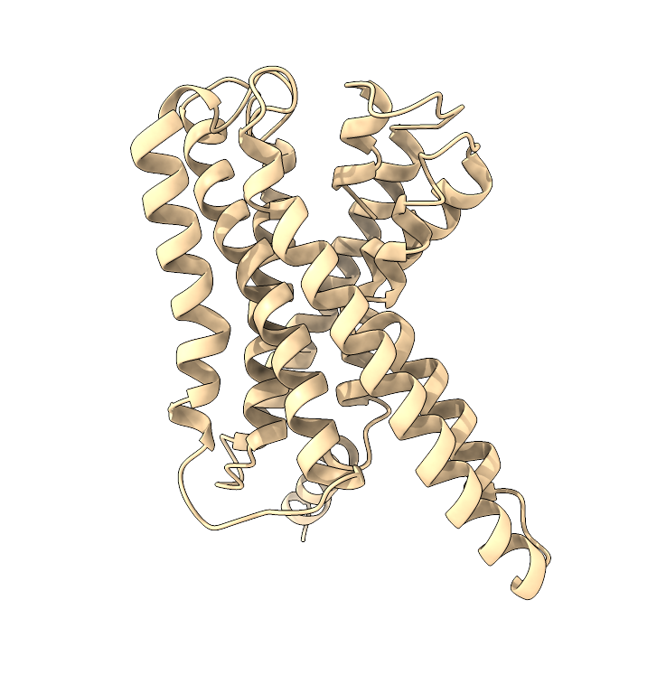
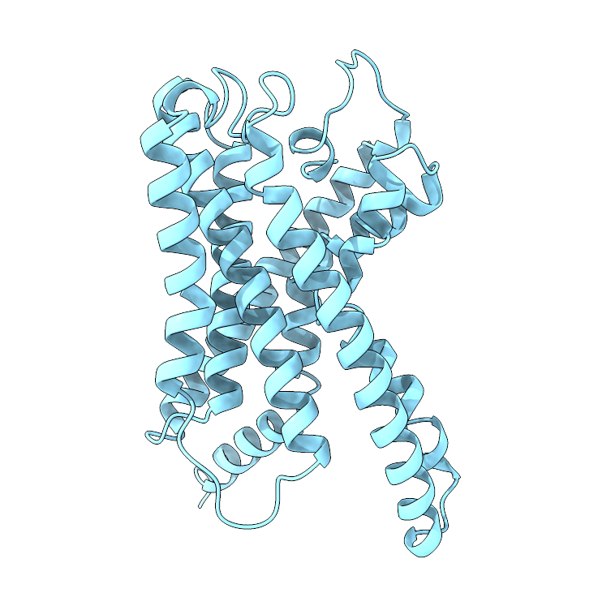
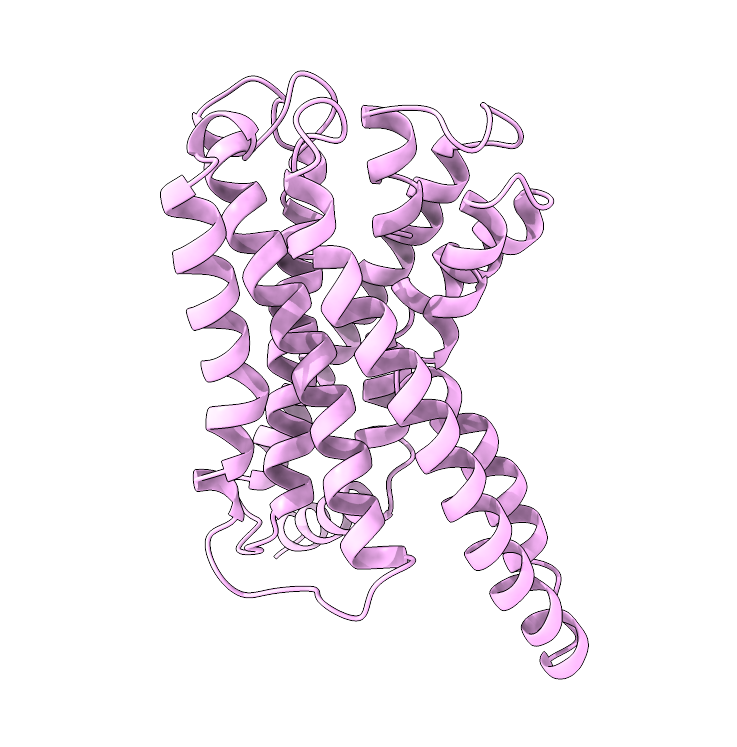
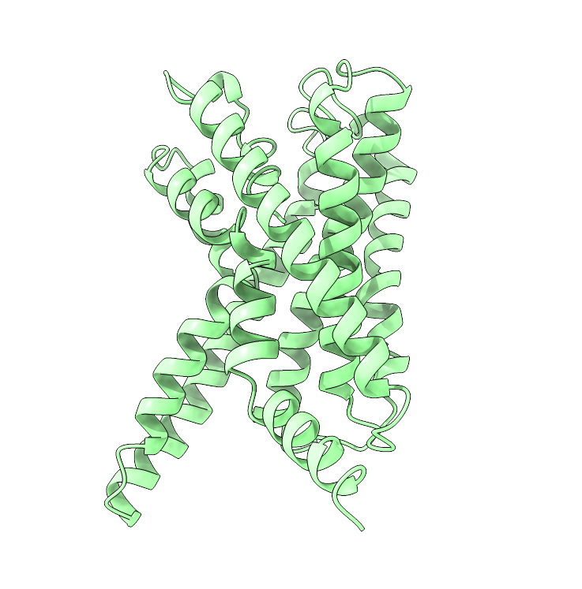

::: {.panel-tabset}

## Introduction
#### Introduction

This guide will provide a brief overview of a [G protein-coupled receptor](https://en.wikipedia.org/wiki/G_protein-coupled_receptor) (GPCR) system. GPCRs are membrane-embedded proteins that mediate signalling across lipid bilayers by detecting molecules outside the cell and activating the corresponding intra-cellular responses. They are characterized by seven trans-membrane $\alpha$ helices that pass through the cell membrane with the N-terminal in the extracellular region and the C-terminal in the intracellular one. There are several classes of GPCRs, but here we focus on an old evolutionary class B2 adhesion GPCR [@liebscher2022stachel] (or *stachel GPCR*). Adhesion GPCRs are pivotal in several physiological processes since they mediate cell–cell or cell–matrix interaction with intracellular G protein-mediated signalling.

Despite being trans-membrane proteins, i.e., systems in which the lipid scaffolding is fundamental to their functioning, GPCR experimental structures are generally published without the embedding lipid bilayer, although sometimes lipid molecules bound to specific GPCR binding sites are resolved, as shown here in @fig-gpcr-chl in the $\beta$-adrenergic receptor.

::: {#fig-gpcr-chl}



Cholesterol lipid molecule resolved with X-ray crystallography for ADRB1 from PDB ID: [7BVQ](https://www.rcsb.org/structure/7BVQ).
:::

Nowadays, there are well-established procedures to embed proteins in lipid bilayer and thus properly simulate the (closest) physiological state of these system, arguably the most known being [CHARMM-GUI webserver](https://www.charmm-gui.org/). Nevertheless, to better focus on how to set up the simulation box to get the simulations going and analyze data, the starting structure provided in this tutorial is already embedded in a mixed lipid bilayer of cholesterol and phosphatidylcholine (POPC), a common mixture for cell membrane simulations.

## Set-up
#### A look into the starting files

First of all, start by downloading the exercise directories from the github repository.

<div class="download-buttons">
  <a href="https://github.com/obzehn/advanced_modelling_for_pharma/raw/main/material/GPCR_structure_1_exercise.tar.gz" class="btn">
    
    <span>Download Structure 1</span>
  </a>

  <a href="https://github.com/obzehn/advanced_modelling_for_pharma/raw/main/material/GPCR_structure_2_exercise.tar.gz" class="btn">
    
    <span>Download Structure 2</span>
  </a>

  <a href="https://github.com/obzehn/advanced_modelling_for_pharma/raw/main/material/GPCR_structure_3_exercise.tar.gz" class="btn">
    
    <span>Download Structure 3</span>
  </a>

  <a href="https://github.com/obzehn/advanced_modelling_for_pharma/raw/main/material/GPCR_structure_4_exercise.tar.gz" class="btn">
    
    <span>Download Structure 4</span>
  </a>
</div>

We provide four different structures. These are all different structures of the same adhesion protein in the same lipid bilayer. You should download and run simulations of at least two of them, so that you can compare the structures at the end of the molecular dynamics simulation. You can unzip the downloaded directories with the command

```bash
tar -xvf name_of_compressed_file.tar.gz
```

The individual directories of the different structures are organized as in the following

```bash
GPCR_structure_X_exercise
│   ionize.mdp
│   reference_topology_GPCR_structure_X.gro
│   reference_topology_GPCR_structure_X.top
│   sbatch_me.sh
│   water_removal.py
│
└─── forcefield
│   │   [various forcefields files]
│
└─── step1_em
│   │   em.mdp
│
└─── step2_nvt
│   │   [various nvt.mdp files]
│
└─── step3_npt
│   │   [various npt.mdp files]
│
└─── step4_prod
    │   prod.mdp
```

Going by order, you can see

- The `ionize.mdp`, `reference_topology_GPCR_structure_X.gro`, `reference_topology_GPCR_structure_X.top`, and `water_removal.py` files. These are the building blocks to set up your starting configuration. These will be covered in depth later in this tutorial;

- A `sbatch_me.sh` file. This is a text file that contains the set of instructions that will run your starting configuration through energy minimization, NVT, NPT, and eventually the production phase;

- A `forcefield` directory. Inside this, you can find several text files that define 'numerically' the key components of your system. You might recognize some of them, like `GPCR.itp`, `cholesterol.itp`, and `POPC.itp`. You can peek inside them and take a look at how a molecule is described numerically in MD simulations. The format of these files - that is, how these numbers are organized and reported - depends on the software you are using. Since in this course you use GROMACS, these files are written in GROMACS format. However, while these numbers and these files might be different for other softwares, the core idea of numerically representing with specific functions the intra- and inter-molecular interactions is paramount in molecular dynamics;

- The `step1_em`, `step2_nvt`, and `step3_npt` directories. Inside each of these you can find one or more `mdp` (molecular dynamics parameters) files that will be used to compile and run the energy minimization, the NVT, and the NPT equilibrations. These will be run sequentially by the script `sbatch_me.sh`, taking your starting configuration through a set of equilibration phases to relax the starting configuration gradually and avoid the system exploding;

- The `step4_prod` directory. Here there is the `prod.mdp` file, which is the final mdp file for the production run of the system. This is usually the longest part of the simulation, which can take 3 to 5 days on Baobab depending on the system. The final output files of the simulation will be inside this directory, and the analysis for the exam will mainly revolve around the `prod.xtc` trajectory file.

The idea of this tutorial is to give you the main ingredients to build your own solvated simulation box without going through the hassle of finding a good target to simulate, fix the experimental structure files, find a consistent force field to describe the system, and embedding the protein in the membrane. Considering this, inside the main directory you can find a copy of four files which will be the basic blocks to build the system, namely

- `ionize.mdp`, the mdp file to add the ions in the system;

- `reference_topology_GPCR_structure_X.gro`, the starting structure that contains the trans-membrane domain of the GPCR already embedded in the membrane;

- `reference_topology_GPCR_structure_X.top`, the starting topology of the system;

- `water_removal.py`, a python script that removes the water molecules that GROMACS wrongly positions within the lipid bilayer during the solvation phase.

From these, and if needed by using as reference the [Lysozyme in water](http://www.mdtutorials.com/gmx/lysozyme/) tutorial for solvation and ion addition, you should be able to obtain three files, that is the starting configuration of the solvated membrane, which you will name `start.gro`, the updated topology of the system, which you will name `topol.top`, and the index file of the system, which you will name `index.ndx`, which is a useful tool for better controlling complex multi-phase systems like a protein embedded in a lipid bilayer. These files will be then picked up by the `sbatch_me.sh` script and used as starting point to run the equilibration and the production runs of the system.

::: {.callout-note}
## Note

The rest of this tutorial will show the set-up of the simulation box by using as example the GPCR structure 1. Nevertheless, the logic of the procedure is identical and can be applied directly to all the other structures as well.

:::

#### Preparing the HPC environment

Send the directory with the exercises to your home in Baobab (with `scp`) and login into Baobab or directly download it in a Baobab folder. Then, request a node with and interactive job for a couple of hours with `salloc` in the following way

```bash
salloc --ntasks=1 --cpus-per-task=4 --partition=private-gervasio-cpu --time=120:00
```

Finally, source the GROMACS installation

```bash
module load GCC/11.3.0
module load OpenMPI/4.1.4
module load GROMACS/2023.1-CUDA-11.7.0
```

and verify that the sourcing was okay by typing

```bash
gmx --version
```

Notice how here you are requesting 4 CPUs but no GPU, differently from the HPC tutorial (in fact, you are on `--partition=private-gervasio-cpu`). In this case, you are going to use the allocation on Baobab just to set up the box and not to run the simulation, so the GPU is not needed.

You are now ready to assemble the starting configuration of the system. One last point before moving on. GROMACS has a lot (> 100) tools that are accessible by typing `gmx` followed by a keyword. In this tutorial you will use `solvate`, `grompp`, `genion`, and `make_ndx`. If you have any doubts remember that you can look online for the explanation of the tool and which flags are needed (`-f`, `-o`, `-s` etc.). For example, [this](https://manual.gromacs.org/current/onlinehelp/gmx-solvate.html) is the manual page of `gmx solvate`. All this information is also available on the spot if you type `-h` or `--h` (for *help*) after the tool's name, e.g., `gmx solvate --h`.

## Solvating

#### Solvating
At the beginning, you can take a look at the starting topology (`reference_topology_GPCR_structure_1.top`) and the starting configuration to solvate (`reference_topology_GPCR_structure_1.gro`). The topology reads like this

```bash
#include "./forcefield/forcefield.itp"
#include "./forcefield/cholesterol.itp"
#include "./forcefield/GPCR.itp"
#include "./forcefield/POPC.itp"
#include "./forcefield/tip4pd.itp"
#include "./forcefield/ions.itp" 

[ system ]
; Name
GPCR structure 1

[ molecules ]
; Compound        #mols
GPCR                1
CHL    	           70
POPC  	          280
```

First of all, notice that sometimes there are lines starting with a semi-column `;`. These are **comments**, that is, lines that are not read by GROMACS. Comments are used to annotate the files and write down details that are helping you - the users - remember what you are doing, what is the meaning of some variables, etc. To all effects, these are equivalent to your notes on the border of a book or on a slide to write something that is worth remembering, e.g. some explanation of the professor. They are ignored by the software and should be informative for the person writing or for the person supposed to read the code. Feel free to write your own comments, if it helps you. Just remember to put a `;` at the beginning of each line that you do not want to be read by GROMACS (you can't forget, as if you do the GROMACS commands that read these files will fail and complain about non-sensical lines).

Following up, the `#include` statements tell GROMACS where to find the elements of the force field. As can be seen, they are collected inside the `forcefield` directory and must appear with a specific order. First, the set of parameters defining the force field (`forcefield.itp`). Then, the definition of the individual molecules (`cholesterol.itp`, `GPCR.itp`, etc.) that will populate your system. These do not have to appear in a specific order, however <ins>all</ins> the molecules that you intend to use <ins>must</ins> be defined here. Building the topology, that is, filling in this file, is roughly the equivalent of running `gmx pdb2gmx` on the pdb file of the protein, sa you did in the Lysozyme tutorial. After the the `#include` statements, there is the `[ system ]` section, which is simply the name of the system. It is worth giving the system a meaningful name to help in recognising the systems in the future.

Finally, there is the `[ molecules ]` section. This is a very important section which must contain <ins>all</ins> the molecules of the system <ins>in the order in which they appear</ins>. Notice that, for the time being, the topology contains one GPCR, 70 cholesterol molecules (`CHL`), and 280 phospholipids (`POPC`).

Now, take a look at the starting configuration `reference_topology_GPCR_structure_1.gro` by opening this file with a text reader. The `.gro` file has a fixed format, and it is better to not modify it by hand if you are not completely sure about what you are doing. The first lines look like this

```bash
GPCR structure 1
47140
    1NTHR     N    1   5.174   5.111   3.908  0.0000  0.0000  0.0000
    1NTHR    H1    2   5.156   5.041   3.838  0.0000  0.0000  0.0000
    1NTHR    H2    3   5.086   5.138   3.950  0.0000  0.0000  0.0000
    1NTHR    H3    4   5.223   5.065   3.984  0.0000  0.0000  0.0000
    1NTHR    CA    5   5.256   5.221   3.857  0.0000  0.0000  0.0000
[...]
```

The file has a first line which contains the title of the box (`GPCR structure 1`), a second line which contains the number of the atoms in the box (`47140`), and then it contains in order all the atoms of the system. These are organized usually as nine columns. The first (here `1NTHR`) is the specific number and name of the residue - which in this case is the N-terminal of the GPCR. The second column contains the specific name of the atom, and usually the first letter indicates the element (here you have a nitrogen followed by three hydrogen and a carbon and so on). The third is simply the number of the entry. It always starts with `1` and goes up to the number of elements in the box. Then, columns four to six contain the x, y, and z coordinates of that atom, while the columns seven to nine contain its velocity, reported by axial component. Notice how all atoms always have a position, but might have zero velocity. This is the case now, as you are building the box from a static experimental image. One of the main roles of the equilibrations phase is this - to relax the starting positions and assign reasonable starting velocities to all the atoms.

At the other end of the file, the last lines look like this

```bash
[...]
 1193POPC  C11847137   9.898   1.890   4.009  0.0000  0.0000  0.0000
 1193POPC  H18R47138   9.885   1.793   3.961  0.0000  0.0000  0.0000
 1193POPC  H18S47139   9.807   1.907   4.069  0.0000  0.0000  0.0000
 1193POPC  H18T47140   9.985   1.888   4.075  0.0000  0.0000  0.0000
  10.06535  10.06535  10.56089
```

The meaning of the columns is the same as before. The last molecules to appear are the phopsholipids (and in fact, in the topology, they are reported last). The last line of a `.gro` file has, like the first two, a special meaning. It contains the coordinates of the box, that is, the length of the box along x, y, and z. For example, this box is roughly a cube, with x and y lengths of `10.06535` nm and z length of `10.56089` nm. Sometimes, for special types of boxes (like those used for the protein-ligand simulations), there might be more than three values reported. The starting configuration, which you can visualize with [VMD](https://www.ks.uiuc.edu/Research/vmd/), is reported in @fig-gpcr-start.

::: {#fig-gpcr-start}


Side (left) and top (right) view of the system. The GPCR is reported in red as cartoons, while the lipids are shown in sticks colored in red (oxygen), blue (nitrogen), cyan (carbon), white (hydrogen), and yellow (phosphorus). The box is shown as blue lines.
:::

The first step is then to solvate the system. In the Lysozyme tutorial, before solvation, the `gmx editconf` command is used to prepare the box and to make it large enough to fit the protein. Here, you do not use it as the box is already prepared because it depends on the width of the lipid bilayer.

Before running `gmx solvate`, you have to know which water model you want to use. For this force field, as also reported in the `reference_topology_GPCR_structure_1.top` file, the model is [TIP4PD](https://en.wikipedia.org/wiki/Water_model) (you are importing the parameters with this line `#include "./forcefield/tip4pd.itp"`), a four-point water model. This means that each water molecule in your simulation will be actually represented with four sites: one oxygen atom, two hydrogen atoms, and a dummy site near the oxygen atom that has negative charge. This dummy atom is a numerical trick to better represent the distribution of charge of the lone pair in water's oxygen. To access four-points water models, the flag name for `gmx solvate` is `-cs tip4p.gro`.

Thus, you can solvate the system with the following

```bash
gmx solvate -cp reference_topology_GPCR_structure_1.gro -cs tip4p.gro -o GPCR_structure_1_solvated.gro
```

where you are asking to add water to the structure with `-cp reference_topology_GPCR_structure_1.gro`, use as reference a four-points water model with `-cs tip4p.gro`, add call the resulting output structure `-o GPCR_structure_1_solvated.gro`. Some of you may notice that in the Lysozyme tutorial you also have to pass the topology of the system with the `-p` flag. This is not mandatory, but if you pass it then the updated topology will have the same name as the input one, which makes things harder to trace back if something goes wrong. However, if you do not pass the topology, you will have to update it by hand to include the presence of the water molecules.

The (last lines of the) output of the solvate command will look something like this

```bash
[...]
Volume                 :     1069.94 (nm^3)
Density                :        1013 (g/l)
Number of solvent molecules:  21053
```

GROMACS tries to fill the box with water to reach the density of ca. 1g/L. The most important part here is the number of water molecules inserted, in this case `21053` (this number can oscillate slightly). In principle, you could add this number at the end of the topology and you would be done with the solvation, as in the Lysozyme tutorial. However, you might think that the system has actually more than one phase (lipids and protein) and that GROMACS tried to insert water molecules in each and every empty volume it could find. How did it behave near the protein and the lipids? You can check with VMD.

#### Removing additional water

The results after solvation are shown in @fig-gpcr-solv. Water has been inserted in all places where it was possible, also between the lipids, which is not realistic as this is a strong lipophilic (non-hydrophobic) region. Generally, this is not a major problem, and within the first nanoseconds of run the water molecules get expelled naturally because of the chemical nature of the lipid tail region. Nevertheless, for delicate systems like this that involve proteins highly susceptible to not physiological starting configurations, it is better to get rid of them and clean the system before adding the ions.

You can remove these wrongly placed water molecules with the `water_removal.py` Python script, which you can run with the following command

```bash
python3 water_removal.py GPCR_structure_1_solvated.gro GPCR_structure_1_solvated_clean.gro
```

The script takes as input `GPCR_structure_1_solvated.gro`, check where there are overlapping water molecules with the lipids and the protein, removes them, and returns the cleaned system under the name `GPCR_structure_1_solvated_clean.gro`. The output looks something like this

```bash
Initial number of water molecules: 21053
Number of water molecules to be deleted: 2117
Final number of water molecules: 18936
```

The script removed ca. 2000 water molecules. You can see now, in @fig-gpcr-solv, that the system has been cleaned and looks much more biologically sound.


::: {#fig-gpcr-solv}


On the left, the solvated system after `gmx solvate`. On the right, the same system after removing ca. 2000 water molecules with the `water_removal.py` script. Protein and lipids are reported in grey, while water molecules in red (oxygen) and white (hydrogen). The fourth site of this water model is in a lighter red tone, but it nearly overlaps with the water oxygen atoms, and is thus practically invisible.
:::

If you take a look at the `GPCR_structure_1_solvated_clean.gro` file, you will notice that the last lines will look like the following

```bash
[...]
22246SOL     OW31349   9.408   9.566   9.374
22246SOL    HW131350   9.375   9.645   9.418
22246SOL    HW231351   9.463   9.599   9.303
22246SOL     MW31352   9.411   9.580   9.371
  10.06535  10.06535  10.5608
```

where `SOL` is the name of the solvent molecules, water), and each `SOL` molecule has four atoms. The box size, as expected, didn't change. You may notice that `gmx solvate` also removed the columns with the velocities. This is not a problem, as during the thermal equilibration (the NVT phase) GROMACS will calculate and reintroduce them. Moreover, when there are many atoms in the box, the space between the second and the third column might disappear. For example, `OW31349` is an atom called `OW` and it's the entry number `31349`, but the space between is not present anymore. This also is not a problem sa long as the length of each field remains constant.

The first lines look like before exception made for the number of atoms, which now has been updated to contain also those of water (in fact the starting dry box had 47140 atoms to which you added 18936 four-point water molecules, that is `47140 + 18936 x 4 = 122884`).

```bash
GPCR structure 1
122884
    1NTHR     N    1   5.174   5.111   3.908
    1NTHR    H1    2   5.156   5.041   3.838
    1NTHR    H2    3   5.086   5.138   3.950
    1NTHR    H3    4   5.223   5.065   3.984
    1NTHR    CA    5   5.256   5.221   3.857
[...]
```

Now, you can update the topology. First, copy the reference topology and call it `reference_topology_GPCR_structure_1_solvated.top`

```bash
cp reference_topology_GPCR_structure_1.top reference_topology_GPCR_structure_1_solvated.top
```

Then, add the amount of water molecules to `reference_topology_GPCR_structure_1_solvated.top` by correcting the `[ molecules ]` section in the following way

```C++
[...]
[ molecules ]
; Compound        #mols
GPCR                1
CHL    	           70
POPC  	          280
SOL             18936
```

You have to add the name of the water in the box (`SOL`) and the number reported after cleaning up the system with the python script. At this point, the structure of the solvated system is contained in `GPCR_structure_1_solvated_clean.gro`, while its topology in `reference_topology_GPCR_structure_1_solvated.top`.

## Adding ions

#### Adding ions

You are now ready to add the ions in the system. First, you need to generate a `.tpr` file, which is a binary file that GROMACS can read to understand the charges of the different molecules in the system and select automatically how many ions should be added. You can do this by using `gmx grompp` and pointing to the parameters file `ionize.mdp` with the flag `-f`, to the starting solvated structure `PCR_structure_1_solvated_clean.gro` with the flag `-c`, to the solvated topology `reference_topology_GPCR_structure_1_solvated.top` with the flag `-p`, and finally name the output tpr file `ionize.tpr` with the flag `-o`

```bash
gmx grompp -f ionize.mdp -c GPCR_structure_1_solvated_clean.gro -p reference_topology_GPCR_structure_1_solvated.top -o ionize.tpr
```

You will see that the command fails with a fatal error. If you look at the error, you can see a section with the following information

```bash
NOTE 2 [file reference_topology_GPCR_structure_1_solvated.top, line 17]:
  System has non-zero total charge: 7.000000
  Total charge should normally be an integer. See
  http://www.gromacs.org/Documentation/Floating_Point_Arithmetic
  for discussion on how close it should be to an integer.

WARNING 1 [file reference_topology_GPCR_structure_1_solvated.top, line 17]:
  You are using Ewald electrostatics in a system with net charge. This can
  lead to severe artifacts, such as ions moving into regions with low
  dielectric, due to the uniform background charge. We suggest to
  neutralize your system with counter ions, possibly in combination with a
  physiological salt concentration.
```

Basically, a tpr file is used to run simulations. As such, when GROMACS tries to prepare one through `gmx grompp`, it check if the physics of the system is reasonable or not. In this case, it found that your system has a net charge of +7, and is telling you that this is very bad as the systems should always have zero total net charge. You can bypass this check by adding the flag `--maxwarn 1` to the command, that is, ignore one (and only one) warning

```bash
gmx grompp -f ionize.mdp -c GPCR_structure_1_solvated_clean.gro -p reference_topology_GPCR_structure_1_solvated.top -o ionize.tpr --maxwarn 1
```

You will see that now GROMACS still complains, but gets the job done. It is very important, however, to understand that the ionization step is nearly the **only** case in which it is okay to use the `--maxwarn` flag, as you **know** that the physics of the system is wrong and you actually need the tpr to fix it with `gmx genion`. In general, you should **never** use this flag. If there is a major warning and a GROMACS command fails, then you have to check why and fix the problem. You may be temped to use `--maxwarn` to get through errors you do not understand, and the flag will let you do it. Nevertheless, the simulation will probably fail instantly the moment you try to run it, and, if not, you are likely to produce garbage results due to overlooking fundamental physics mistakes in the box preparation.

Now, you should have a `ionize.tpr` file in your directory, following the `gmx grompp` command. You are ready to insert the ions with the following command

```bash
gmx genion -s ionize.tpr -neutral -pname NA -nname CL -o start.gro
```

Here, you are asking GROMACS to make the system neutral (`-neutral`), call the positive ions `NA`, the negative ions `CL`, and call the resulting output `start.gro`. Trivially, within this force field the atoms NA and CL refer to sodium (Na, +1) and chlorine (Cl, -1) ions. Again, differently from the Lysozyme tutorial, you are not giving as input the topology and you will update it after the addition of ions. With `gmx genion`, GROMACS tries to substitute some molecules in the system with the necessary number of ions. You will be prompted by GROMACS to choose which part of the system you are okay to substitute in favour of water molecules

```bash
Will try to add 0 NA ions and 7 CL ions.
Select a continuous group of solvent molecules
Group     0 (         System) has 122884 elements
Group     1 (        Protein) has  4440 elements
Group     2 (      Protein-H) has  2187 elements
Group     3 (        C-alpha) has   282 elements
Group     4 (       Backbone) has   847 elements
Group     5 (      MainChain) has  1129 elements
Group     6 (   MainChain+Cb) has  1395 elements
Group     7 (    MainChain+H) has  1407 elements
Group     8 (      SideChain) has  3033 elements
Group     9 (    SideChain-H) has  1058 elements
Group    10 (    Prot-Masses) has  4440 elements
Group    11 (    non-Protein) has 118444 elements
Group    12 (          Other) has 42700 elements
Group    13 (            CHL) has  5180 elements
Group    14 (           POPC) has 37520 elements
Group    15 (          Water) has 75744 elements
Group    16 (            SOL) has 75744 elements
Group    17 (      non-Water) has 47140 elements
Select a group: 
```

From the first line you can see that GROMACS understood that the system has a total of +7 charge and will then need seven negative ions to have a total of zero net charge. Since you do not want to substitute any part of the protein or lipids with ions, choose the `SOL` group, the number 16, and GROMACS will randomly choose seven water molecules, remove them and place there a chlorine ion.

```bash
Selected 16: 'SOL'
Number of (4-atomic) solvent molecules: 18936
Using random seed -819201.
Replacing solvent molecule 1842 (atom 54508) with CL
Replacing solvent molecule 5002 (atom 67148) with CL
Replacing solvent molecule 3105 (atom 59560) with CL
Replacing solvent molecule 1445 (atom 52920) with CL
Replacing solvent molecule 4490 (atom 65100) with CL
Replacing solvent molecule 4475 (atom 65040) with CL
Replacing solvent molecule 6661 (atom 73784) with CL
```

As for the solvation, you need now to update the topology as some water molecules have been removed and some chlorine ions have been added. Start by copying the solvated topology into a new topology called `topol.top`

```bash
cp reference_topology_GPCR_structure_1_solvated.top topol.top
```

and change the `[ molecules ]` section by removing the seven water molecules from the total and adding the seven chlorine ions (`CL`)

```C++
[ molecules ]
; Compound        #mols
GPCR                1
CHL    	           70
POPC  	          280
SOL             18929
CL                  7
```

Summarizing, you now have the starting solvated and neutralized configuration stored in `start.gro` and the corresponding topology in `topol.top`. You can take a look at the final system with VMD. It should look similar to that shown in @fig-gpcr-ions.

::: {#fig-gpcr-ions}


Side (left) and top (right) view of the system after solvation and ion addition. Water is reported as a transparent white surface. The chlorine ions are shown as yellow spheres based on their van der Waals radii. Remember that all the atoms in the system are actually points without a radius described by a set of coordinates, they are not spheres. However, you can use their van der Waals radii to estimate how 'large' the atoms are, that is, how much space around them is physically precluded to other atoms due to the atomic repulsion of the inter-molecular van der Waals forces.
:::

## Make an index
#### Generate the index file


The last passage before running the simulation is to generate and **index** file. This type of file is used to name part of the system by grouping the corresponding atom numbers under a given name. In this case, you need an index file because the thermostat is expecting two different groups to couple for temperature regulation, one that contains the protein and the lipids, which you will call `Protein_and_memb`, and one that contains the water and the ions, which you will call `Water_and_ions`. The reasons behind this are technical and go beyond the scope of this tutorial. However, the index file is a powerful tool to access only parts of the simulation box, and as such it is important to know how to generate one.

The command to generate and index file is `gmx make_ndx`. As input you should give the final configuration and call the output simply `index.ndx`, as in the following

```bash
gmx make_ndx -f start.gro -o index.ndx
```

GROMACS will answer by showing you what types of molecules it sees inside the box and which name it would give to them

```bash
  0 System              : 122863 atoms
  1 Protein             :  4440 atoms
  2 Protein-H           :  2187 atoms
  3 C-alpha             :   282 atoms
  4 Backbone            :   847 atoms
  5 MainChain           :  1129 atoms
  6 MainChain+Cb        :  1395 atoms
  7 MainChain+H         :  1407 atoms
  8 SideChain           :  3033 atoms
  9 SideChain-H         :  1058 atoms
 10 Prot-Masses         :  4440 atoms
 11 non-Protein         : 118423 atoms
 12 Other               : 42700 atoms
 13 CHL                 :  5180 atoms
 14 POPC                : 37520 atoms
 15 CL                  :     7 atoms
 16 Water               : 75716 atoms
 17 SOL                 : 75716 atoms
 18 non-Water           : 47147 atoms
 19 Ion                 :     7 atoms
 20 Water_and_ions      : 75723 atoms
```

A few of these groups are very important, e.g., group 1 is the protein, group 13 contains the cholesterol lipids while group 14 the POPC lipids, and so on. You can also see that GROMACS already puts together in a group water and ions (group 20, `Water_and_ions`). Thus, you will only need to generate another group that contains everything excluded water and ions, that is, the protein and the lipids. You can achieve this by typing

```bash
1 | 13 | 14
```

and pressing enter. You can read the legend at the end of the list of groups to understand what you just did. You basically said to take everything that is inside group 1 OR inside group 13 OR inside group 14, which means `Protein`, `CHL`, and `POPC` groups. If you press enter again, GROMACS will show the list of groups inside the index file, and you can see how now there is a new one at the end

```bash
[...]
 18 non-Water           : 47147 atoms
 19 Ion                 :     7 atoms
 20 Water_and_ions      : 75723 atoms
 21 Protein_CHL_POPC    : 47140 atoms
```

which is the union of the protein with the lipids. You can rename it by typing

```bash
name 21 Protein_and_memb
```

that is, take group 21 and rename it `Protein_and_memb`. Press enter again to confirm the command, and you will see now that the group changed name

```bash
[...]
 18 non-Water           : 47147 atoms
 19 Ion                 :     7 atoms
 20 Water_and_ions      : 75723 atoms
 21 Protein_and_memb    : 47140 atoms
```

You can exit the index generation by typing `q` and pressing enter. In your main directory you should now have the starting configuration `start.gro`, the corresponding topology `topol.top`, and the index file that you just generated, `index.ndx`. This is all what you need to run the following simulations. Each system directory reports also these files already prepared in the corresponding `solution_files` directory. You can compare the files that you obtained with those collected in this directory. Remember however that you can't mix the files. For example, let's suppose that you were able to obtain the `start.gro` initial configuration and the corresponding `topol.top` topology, but not the index file. You can't use the `index.ndx` file in the solution directory, as this was generated by using the `start.gro` file inside that same directory, which might have small differences in the water content. You should use all the files that have been generated one from the other to avoid inconsistencies.

## Dynamics
#### A look at the `sbatch_me.sh` file
Whether you completed the tutorial or you moved the corresponding files from the `solution_files` directory, now the content of the exercise directory should be similar to this

```bash
GPCR_structure_X_excercise
│   sbatch_me.sh
│   index.ndx
│   start.gro
│   topol.top
│
└─── forcefield
│
└─── step1_em
│   │   em.mdp
│
└─── step2_nvt
│   │   [various nvt.mdp files]
│
└─── step3_npt
│   │   [various npt.mdp files]
│
└─── step4_prod
    │   prod.mdp
```

plus the `solution_files` directory and some leftover files from the system generation. It is mandatory that `sbatch_me.sh`, `index.ndx`, `start.gro`, and `topol.top` are together in the same directory in which there are the energy minimization, NVT, NPT, and production directories, otherwise the script `sbatch_me.sh` won't be able to run the simulations for you.

During both the Lysozyme tutorial and the preparation of the box for this exercise, you logged in a Baobab node by using the `salloc` command. In this way you can have access to a node and run an interactive job. This is nice because you can have real time answers from the node and you see clearly what is going on and what you are doing, which is pivotal for error-prone procedures like the generation of the starting box. However, when you close the connection, log out from Baobab, or simply turn off the computer, you lose the access to the computer and any running simulation will stop. Does this mean that you should be always connected? And that you should stay constantly in front of your computer, even for a few days at a time, while the simulations run, scared or losing the internet connection and see your runs fail?

Clearly this is not the case. As explained also in the [Introduction to HPC](/introduction_baobab.qmd) of this github page, Baobab has a so-called queueing system, named [slurm](https://slurm.schedmd.com/overview.html). With slurm, you can prepare a *submission script* that contains the main commands that you want to run alongside the resources you need. This is exactly what the `sbatch_me.sh` script is.

You can look at the content of the `sbatch_me.sh` with a text editor. The first lines look like this

```bash
#!/bin/bash 

#SBATCH --account=gervasio_teach_19h330
#SBATCH --partition=private-gervasio-gpu
#SBATCH --time 144:00:00
#SBATCH --job-name GPCR1
#SBATCH --error jobname-error.e%j
#SBATCH --output jobname-out.o%j
#SBATCH --ntasks 1
#SBATCH --cpus-per-task 16
#SBATCH --nodes 1
#SBATCH --gpus-per-node=nvidia_geforce_rtx_3080:1
#SBATCH --hint=nomultithread

[...]
```

You can recognise some of the flags that you were giving to the `salloc` command, such as `--partition=private-gervasio-gpu` and `--cpus-per-task 16`. Basically these lines are specifying which kind of hardware you need to run the simulations. If you are curious, you can look up their meaning in the slurm website.

Slurm reads this files and sends you in a queue while it waits to find some computer that is available and that has the requested hardware. When it finds it, it takes control for the amount of time specified in `--time 144:00:00`, that is, six days. This amount of time will be sufficient to both conclude the equilibration and the production runs. As in the interactive case, the first thing to do once the node is allocated is to source GROMACS, which is the first thing done by the script with the lines following the `#SBATCH` node requests, i.e., with the following

```bash
[...]
module load GCC/11.3.0
module load OpenMPI/4.1.4
module load CUDA/11.7.0
module load GROMACS/2023.1-CUDA-11.7.0
[...]
```

Then there are a few technical details about how GROMACS should use the available resources to run the simulations with `gmx mdrun` (e.g. `-ntmpi`, `-ntomp`, etc.). Lastly, there are a series of `cd` commands that enter the `step1_em`, `step2_nvt`, `step3_npt`, and `step4_prod` directories and systematically run `gmx grompp` to prepare the corresponding tpr files and then run them with `gmx mdrun`.

You can send the submission script `sbatch_me.sh` and let slurm handle the simulations by using the [sbatch](https://slurm.schedmd.com/sbatch.html) command. This should be run from Baobab's head-node, and not from the node that you received by running `salloc`. Thus, if your command line still looks like this

```bash
(baobab)-[username@cpuxxx some_directory_name] $
```

type `exit` to exit the node. Once the terminal looks like this

```bash
(baobab)-[username@login1 some_directory_name]$
```

e.g., your `username` is logged in on `login1`, the head-node of Baobab, and not on some `cpuxxx` or `gpuxxx` node, you are good to go. From the `GPCR_structure_X_excercise` directory, that is, where the submission script `sbatch_me.sh` is located, you can submit it to slurm with the following command

```bash
sbatch sbatch_me.sh
```

If the command runs successfully, slurm returns the number that is assigned to your job, something like this

```bash
Submitted batch job 16567322
```

You can check the status of the job by running (and substituting `username` with yours)

```bash
squeue -u username
```

The output will look something like this

```bash
             JOBID PARTITION     NAME     USER ST       TIME  NODES NODELIST(REASON)
          16567322 private-g    GPCR1 username  R       0:55      1 gpu037
```

The `R` under the column `ST` (for *status*) stands for *running*. Usually, the job stays in the queue with some other status, like `PD`, before changing to `R`. Once it's running, you will see that slurm directly writes the output to the exercise directories, e.g., you will see `em.gro`, `em.trr`, and other output files appearing in `step1_em`, `nvt_1.log`, `nvt_1.gro` etc. in `step2_nvt`, and so on. Now that the job is submitted and running, you can log out from Baobab without risking to lose it. For the GPCRs exercises, the time needed to complete the whole equilibration phase (steps 1 to 3) is of about two hours, while to complete the production it will take roughly five days, so a total of five days overall.

#### A look at the process of equilibration

Differently from the Lysozyme tutorial, here you can see that the NVT and NPT simulations are not unique, but they consist of several steps each, which are run one after the other. For the sake of completeness, you can take a look at the various `nvt_X.mdp` and `npt_X.mdp` files. As introduced before, the lines starting with `;` are comments, that is, they are ignored by GROMACS and are useful only for human readers to organize the code.

Let's take a look at a few key entries in the mdp file.

```bash
[...]
;---------------------------------------------
; INTEGRATOR AND TIME
;---------------------------------------------
integrator               = md
dt                       = 0.002
nsteps                   = 125000
[...]
```

Here you are asking GROMACS to use a [leapfrog integrator](https://en.wikipedia.org/wiki/Leapfrog_integration) by setting `integrator = md`. The integration is performed with a time step `dt` of 0.002 ps, that is, 2 fs, which is the standard for this type of simulations. Lastly, the integration is performed for 125000 steps, as set by `nsteps`, that is, `125000 x 0.002 ps = 250ps`. You can see that the number of steps is relatively short with respect to the production run, as reported in the `prod.mdp` parameters file.

The other most important section is the one where you set the thermostat and barostat settings. For the NVT runs, you have the thermostat that controls the temperature and the parameters look something like this

```bash
[...]
;----------------------------------------------
; THERMOSTAT AND BAROSTAT
;----------------------------------------------
; >> Temperature
tcoupl                   = v-rescale
tc-grps                  = Protein_and_memb Water_and_ions
tau_t                    = 0.5                   0.5
ref_t                    = 300                   300
; >>  Pressure
pcoupl                   = no
[...]
```

The thermostat is connected separately to the two phases of your system, and they are both thermalized at 300K (set by `ref_t`). You can recognize the separate groups that you generated in the index file before (as specified by `tc-grps`). GROMACS uses these names to recognize which part of the system it has to thermalize (in fact you can see that in the `gmx grompp` commands inside the `sbatch_me.sh` script you are also passing the index file with the flag `-n index.ndx`). Notice how there is no pressure coupling (`pcouple = no`). For the NPT runs, instead, the barostat is activated and the box can oscillate and change its volume. You can see the parameters of the barostat in the `THERMOSTAT AND BAROSTAT` sections for any of the `npt_X.mdp` file.

```bash
[...]
; >>  Pressure
pcoupl                   = C-rescale
pcoupltype               = semiisotropic
tau-p                    = 1.0
compressibility          = 4.5e-5  4.5e-5
ref-p                    = 1.0     1.0
[...]
```

The reason why there are several NVT and NPT sub-phases is that the system should be relaxed gradually, otherwise it might distort the starting configuration, which would be detrimental - if not deadly - for the behavior of complex proteins such as GPCRs embedded in lipid bilayers. This can be achieved by putting so-called *restraints* on specific atoms of the system to restrain them in space, that is, to not let them move too much. This behavior is controlled by the parameters defined under the `POSITION RESTRAINTS` section, as in the following example taken from `nvt_1.mdp`

```bash
[...]
;---------------------------------------------
; POSITION RESTRAINTS
;---------------------------------------------
define                    = -DPOSRES_PRO -DPOSRES_FC_SC=1000 -DPOSRES_FC_BB=1000 -DPOSRES_LIP -DRES_LIP_K=1000
[...]
```

The technical implementation and the specific meaning of these parameters is beyond the scope of this tutorial. The take at home message is that, due to the restraints, at the beginning both the lipids and the protein can't really move freely in space, but water can. In this way you can thermalize first the water molecules. Then, gradually, the restraints on the atoms of the system are decreased to let the whole system equilibrate. You can check the values of the parameters in the `POSITION RESTRAINTS` of the `nvt_X.mdp` and `npt_X.mdp` files. You will see that they gradually decrease up to disappearing in the last NPT equilibration.

The production run is usually simulated without restraints at all, and in fact there is no restraint defined in `prod.mdp`, as you would like to simulate the 'natural' behaviour of the system. In this tutorial, the [statistical ensemble](https://en.wikipedia.org/wiki/Ensemble_(mathematical_physics)) of the production run is still the isothermal-isobaric ensemble (NPT), as you can see from the `prod.mdp` file since both the thermostat and the barostat are active. It is informally called *production* because it is the part of the simulation that is used most of the times for the analysis, as it comes after the equilibration and it is supposed to be well relaxed.

## Tips and tricks
#### Tips and tricks for trajectories handling
Trajectories are fidgety things. The standard format of the GROMACS trajectory, an `.xtc` file, contains the positions of the atoms as a function of time, collected as a sequence of frames. The frequency of the output is set by the keyword `nstxout-compressed` in the mdp files, in units of time steps. For the GPCRs productions, this is 10000, that is, `10000 x 0.002 ps = 20 ps`. Considering that the run is long 500 ns, this means that you will collect 25000 frames. The content of the frames is defined by the keyword `compressed-x-grps`. Since this was not set in the mdp files, the default is the whole system, that is, the protein, the lipids, the ions, and all the water molecules. You can imagine how writing coordinates for hundreds of thousands of atoms for thousands of frames can be very memory intensive. Deciding in advance what to print and the frequency is very important, and can save you a lot of space. However, it is better to stay on the safer side as the only way to recover not printed data is to rerun the simulation.

This short section covers a couple of key points in handling trajectories and the representation of periodic boundary conditions. It is important to understand that the information of the trajectory is the same, and changing its representation *doesn't change the content*. There are a few reasons why post-processing of the trajectory is fundamental. The most important is for analysis purposes, as some tools might be sensible to the representation of the molecules. For example, RMSD calculation might break down and give non-sense jumps if the tool that calculates it doesn't reconstruct the trajectory by fixing broken molecules across boundaries. Building on this point, very large trajectories are also hard to handle from the hardware perspective, and it is better to reduce them to the strictly necessary so that tools analyzing them are faster. Handling trajectories is important also for representation purposes, e.g., rendering a fancy image for a publication. Moreover, this is connected to understanding via visualization, as watching the trajectory is very important to gain insights on the system and check possible criticalities, and human eyes work better with whole molecules.

The main tool for trajectory handling in GROMACS is [`gmx trjconv`](https://manual.gromacs.org/current/onlinehelp/gmx-trjconv.html). Take a look at the manual for the optional flags and see if anything fits what you want to do (or check with `gmx trjconv --h`). This is a tool that notoriously necessitates of some experience to achieve an efficient usage, but it is worth pointing out a few key commands. Generally, after running `gmx trjconv` GROMACS asks some further information (depending on the flags you are using) in terms of contents of the system. The most important thing here is to read properly what GROMACS asks and answer accordingly to your own purpose.

The panels of @fig-gpcr-pbc shows a few ways in which the trajectory can be post-processed. The videos were rendered with VMD. They are discussed in the following in a left-to-right order

- The original trajectory, represented as simple lines. Molecules that are broken across the boundaries give rise to the typical spaghetti-like bonds. Notice how nothing leaves the box, as the PBCs put the atoms back in the box, but on the other side. You can change VMD representation in favour of other types less prone to artifacts, like van der Waals radii, but molecules will still visually be broken;

- The trajectory corrected for PBCs broken molecules. This can be achieved with the flag `-pbc mol`. Notice how some lipids seem to be exiting the box: this is the PBC reconstruction carried out by GROMACS. That part of the lipid would be coming back in on the other side of the box, but with `-pbc mol` you are asking GROMACS to make the molecules whole, and so some atoms are moved from one side of the box to the other to complete the molecules. The protein can be seen as it diffuses laterally in the plane bilayer;

- The trajectory re-centered around the protein and corrected for PBCs broken molecules. This can be achieved with the flag `-pbc mol` and `-center` and prompting GROMACS to center the protein in the box. This type of visualization might be useful if you want to focus on the protein rather than the lipids and want to get rid of its diffusion in the membrane;

- The trajectory refitted on the protein first frame. This comes from two concatenated passages. The first usually is the same as the point before this one, that is, PBC removal and re-centering. Then, the output is further post-produced with `trjconv` by setting the flag `-fit rot+trans`, and prompting GROMACS to use the protein alpha carbons as reference. Briefly, GROMACS tries to match the position of the protein in each frame with the starting one (passed with the flag `-s`). You can see how the protein is barely wiggling, and actually is the box that is slightly rotating around it. As before, this type of post-processing is important when the group that is being fitted (the protein here) should stay as still as possible. The protein/ligand malaria targets are a very good example, as this post-processing makes much easier to visualize the binding site and the ligand.

::: {#fig-gpcr-pbc layout-ncol=2}

::: {}
{width="400" fig-align="center"}
:::

::: {}
{width="400" fig-align="center"}
:::

::: {}
{width="400" fig-align="center"}
:::

::: {}
{width="400" fig-align="center"}
:::

Four different ways to re-wrap the same GPCR trajectory. The videos are 25 frames long, 1 frame every 10 ns (250 ns total). Water is removed for clarity. The first panel shows the original trajectory; the second shows molecules made whole across PBCs; the third centers the protein in the box; the fourth aligns the protein to the first frame.
:::

For the exam, the main post-processing of the trajectory that you might need is the removal of the water molecules, as this will make the trajectory much smaller and easy to download and analyze. It is also worth to correct the PBCs and center the protein, which basically means obtaining what is shown in the third panel of Figure 4. You can do this in one command as in the following

```bash
gmx trjconv -f prod.xtc -s nvt_1.tpr -pbc mol -center -o center_traj.xtc
```

and, when prompted by GROMACS, by selecting the group `Protein` for centering and `System` for output. The output will be called `center_traj.xtc` and will contain the whole trajectory where all the molecules are made whole across the PBCs and the protein is centered in the box. You can then fit the protein to its starting position to better visualize the binding site (like panel 4 of Figure 4) as in the following

```bash
gmx trjconv -f center_traj.xtc -s nvt_1.tpr -fit rot+trans -o center_traj_fit.xtc
```

and selecting the protein C alphas for fit and the `System` for output. Now, `center_traj_fit.xtc` will contain the whole trajectory and after centering and fitting it on the starting configuration of the protein contained in `nvt_1.tpr`. This will probably still be a large file, so you can produce a more manageable file for visualization with VMD with the following two commands

```bash
gmx trjconv -f center_traj_fit.xtc -s em.tpr -o nowater.xtc
gmx trjconv -f center_traj_fit.xtc -s em.tpr -o nowater.gro -dump 0
```

In both cases, select `non-Water` as the output group. These will produce two files, `nowater.gro` and `nowater.xtc`, which are the first frame of the production run and the associated trajectory, respectively, but without the water. The files should be much smaller than the original `prod.xtc`. You can use these two files to visualize the trajectory in VMD. You can get rid of the intermediary files and remove them, that is, `rm center_traj.xtc center_traj_fit.xtc`. Beware that [`rm`](https://ss64.com/bash/rm.html), which stands for *remove*, deletes the files directly. There is no Trash/Recycle bin in the terminal, and if by mistake you delete something that you need you will have to redo it, as it can not be recovered easily.

Notice how the tpr passed to trjconv is `nvt_1.tpr`, the one compiled by the `sbatch_me.sh` script following the energy minimization. This is useful in cases where the refitting and re-centering is made more complex by the presence of more than one molecule which should stay consistent in terms of reference frame. Many visualization artifacts can be solved by the usage of a good reference structure (like `nvt_1.tpr`, as in the beginning without dynamics the molecules were still at the centre of the box), some patience, and a good combination of flags (usually `-pbc mol -center` is a good starting point). However, removing water might be a good idea for visualization purposes, but not for analysis ones. What about the interaction of water with the protein, especially if there is a ligand? Are there any? Are they important? For these GPCRs systems, and in the context of this tutorial, the answer is no, and you can just discard them. Nevertheless, use with care and keeping in mind what you want to do with the cleaned trajectory.

As a final statement, the process of reducing the trajectory shown in the latter is transferable to whatever you want to output that is contained in the box. You will just have to select the group you want to maintain in the output when prompted by trjconv. If the specific group you want is not among those automatically suggested, you can create a new one with `gmx make_ndx` and pass the index file to `trjconv` via the flag `-n` as shown in the latter for the index generation of the thermostat groups. 

:::

## References