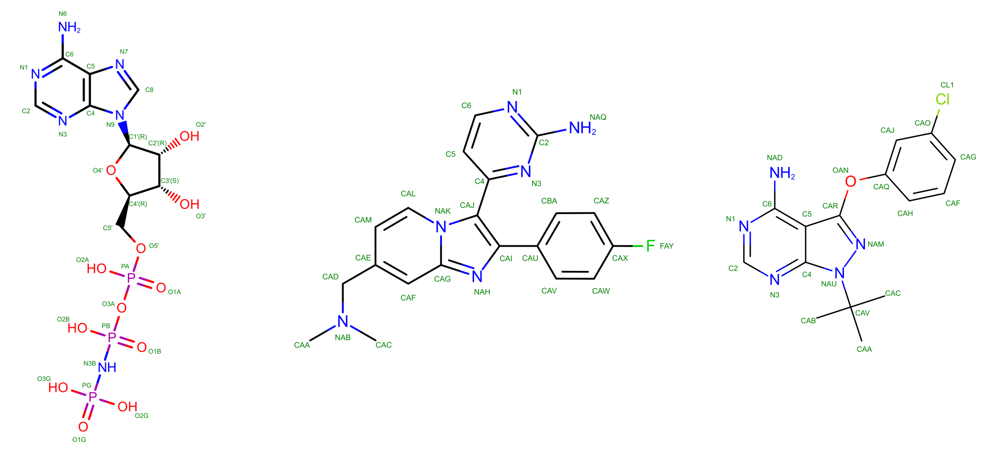



## Introduction
This guide will provide a brief overview of the APO (without ligand) and HOLO (with ligand) states of protein kinase G (PKG), a key regulatory enzyme found in the malaria parasite Plasmodium. In *Plasmodium vivax*, a species responsible for severe forms of [malaria](https://en.wikipedia.org/wiki/Malaria) in humans, PKG plays a critical role in various stages of the parasite's lifecycle, including its development within the mosquito vector and its replication within the human host's red blood cells. PKG is involved in signalling pathways that regulate essential processes such as parasite invasion of host cells, egress from infected cells, and differentiation into sexual forms for transmission to mosquitoes. Additionally, PKG has been identified as a potential target for antimalarial drug development due to its essential role in parasite survival and its divergence from human homologs, making it an attractive candidate for selective inhibition.

Several experimental structures have been deposited for PKG with UNIPROT [A5K0N4](https://www.uniprot.org/uniprotkb/A5K0N4/entry). The PDB IDs user in this tutorial are [5DYL](https://www.rcsb.org/structure/5DYL) for the APO form, [5DZC](https://www.rcsb.org/structure/5DZC) for the HOLO form bound to a non-hydrolyzable analog of adenosine tri-phosphate (here named ANP), [5F0A](https://www.rcsb.org/structure/5F0A) for the HOLO form bound to an inhibitor (here named 1FB), and [5FET](https://www.rcsb.org/structure/5FET) for the HOLO form bound to another inhibitor (here named 1TR). The structure of the ligand is shown in @fig-malaria-ligs.

::: {#fig-malaria-ligs}

2D representation of ANP, 1TR, and 1FB, respectively, the three ligands in the HOLO PKG systems.
:::

The exact role of these molecules when targeting PKG is not strictly relevant for this tutorial. If you are interested you can read the corresponding publication [@el2019structures] from which the APO and HOLO + ANP structures were taken, while the other two come from results still under peer revision and, therefore, unpublished. Differently from GPCRs in the other exercise, PKG is not a membrane protein, and as such it can be simulated in a box of water, analogously to what done during the Lysozyme tutorial.

  <a href="exercise_malaria_targets_part_1.qmd" class="nav-btn next-btn">Next &rarr;</a>

## References