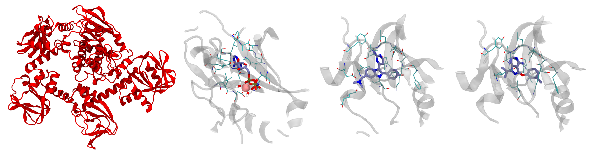



## Getting ready on the cluster

First of all, send the directory with the exercises to your home in Baobab (with `scp`) and login into Baobab or directly download it in a Baobab folder. Then, request a node with and interactive job for a couple of hours with `salloc` in the following way

```bash
salloc --ntasks=1 --cpus-per-task=4 --partition=private-gervasio-cpu --time=120:00
```

Finally, source the GROMACS installation

```bash
module load GCC/11.3.0
module load OpenMPI/4.1.4
module load GROMACS/2023.1-CUDA-11.7.0
```

and verify that the sourcing was okay by typing

```bash
gmx --version
```

Notice how here you are requesting 4 CPUs but no GPU, differently from the HPC tutorial (in fact, you are on `--partition=private-gervasio-cpu`). In this case, you are going to use the allocation on Baobab just to set up the box and not to run the simulation, so the GPU is not needed.

You are now ready to assemble the starting configuration of your system. One last point before moving on. GROMACS has a lot (> 100) tools that are accessible by typing `gmx` followed by a keyword. In this tutorial you will use `solvate`, `grompp`, `genion`, and `make_ndx`. If you have any doubts remember that you can look online for the explanation of the tool and which flags are needed (`-f`, `-o`, `-s` etc.). For example, [this](https://manual.gromacs.org/current/onlinehelp/gmx-solvate.html) is the manual page of `gmx solvate`. All this information is also available on the spot if you type `-h` or `--h` (for *help*) after the tool's name, e.g., `gmx solvate --h`.

## Setting up the box

At the beginning, you can take a look at the starting topology (`reference_topology_PKG_HOLO_ANP.top`) and the starting configuration to solvate (`reference_topology_PKG_HOLO_ANP.gro`). The topology reads like this

```C++
#include "./forcefield/forcefield.itp"
#include "./forcefield/PKG.itp"
#include "./forcefield/ANP.itp"
#include "./forcefield/tip3.itp"
#include "./forcefield/ions.itp"

[ system ]
PKG HOLO with ANP and MG

[ molecules ]
; Compound         #mols
PKG                    1
MG                     1
ANP                    1
SOL                    2
```

First of all, notice that there are lines starting with a semi-column `;`. These are **comments**, that is, lines that are not read by GROMACS. Comments are used to annotate the files and write down details that are helping you - the user - remember what you are doing, what is the meaning of some variables, etc. To all effects, these are equivalent to your notes on the border of a book or on a slide to write something that is worth remembering, e.g. some explanation of the professor. They are ignored by the software and should be informative for the person writing or for the person supposed to read the code. Feel free to write your own comments, if it helps you. Just remember to put a `;` at the beginning of each line that you do not want to be read by GROMACS (you can't forget, as if you do the GROMACS command will simply fail and complain about non-sensical lines).

Following up, the `#include` statements tell GROMACS where to find the elements of the force field. As can be seen, they are collected inside the `forcefield` directory and must appear with a specific order. First, the set of parameters defining the force field (`forcefield.itp`). Then, the definition of the individual molecules (`PKG.itp`, `ANP.itp`, etc.) that will populate you system. These do not have to appear in a specific order, however <ins>all</ins> the molecules that you intend to use <ins>must</ins> be defined here. Building the topology, that is, filling in this file, is roughly the equivalent of running `gmx pdb2gmx` on the pdb file of the protein, as you did in the Lysozyme tutorial. In this case the system is much more complex and the pdb needs further handling. Thus, it wouldn't be possible to do in one simple line within GROMACS, so the topology is already provided. After the `#include` statements, there is the `[ system ]` section, which is simply the name of the system. It is worth giving the system a meaningful name to help in recognising the systems in the future.

Finally, there is the `[ molecules ]` section. This is a very important section which must contain <ins>all</ins> the molecules of the system <ins>in the order in which they appear</ins>. Notice that, for the time being, the topology contains one protein (`PKG`), one magnesium ion (`MG`), one ligand (`ANP`), and two water molecules (`SOL`). This is unique for the HOLO system with ANP, because the ANP ligand is an adenosine tri-phosphate analogue which is coordinated to a magnesium ion together with two water molecules. This is important because the whole complex ANP + MG + 2 H<sub>2</sub>O is the correct physiological state of the HOLO state of this protein when bound to ANP. The ligand doesn't bind without the coordinating water molecules and magnesium ion. GROMACS doesn't know if a ligand necessitates a magnesium or other ions and water molecules in some given positions. Thus, they are part of the initial box **before** the solvation as they have been modelled already in the correct state. This is where the biological and chemical knowledge of the user is critical for building a physiologically correct system. Among the systems presented in this tutorial, ANP is the only ligand that necessitates other molecules to be modelled properly in its binding site. The topologies and starting structures of the other systems contain only the host protein PKG and a ligand (for the HOLO states) or the protein alone (for the APO case). The APO structure and the three ligands are shown in @fig-malaria-start.

::: {#fig-malaria-start}


From left to right: PKG in its APO form; binding site with ANP, the magnesium ion, and the two coordinating water molecules; binding site with 1FB; binding site with 1TR. The residues nearest to the ligands are represented as lines. Color legends: red (oxygen), blue (nitrogen), yellow (phosphorus), pink (magnesium). Carbons are colored in cyan for the protein and ice blue for the ligands. Hydrogen atoms are hidden exception made for the water molecules, where they are white.
:::

Now, take a look at the starting configuration `reference_topology_PKG_HOLO_ANP.gro` by opening this file with a text reader. The `.gro` file has a fixed format, and it is better to not modify it by hand if you are not completely sure about what you are doing. The first lines look like this

```bash
PKG HOLO with ANP ligand
12908
    1ACE     H1    1  12.255   9.683   1.920
    1ACE    CH3    2  12.282   9.770   1.861
    1ACE     H2    3  12.301   9.855   1.927
    1ACE     H3    4  12.202   9.795   1.792
    1ACE      C    5  12.405   9.741   1.784
    1ACE      O    6  12.461   9.632   1.791
    2GLY      N    7  12.452   9.840   1.705
    2GLY      H    8  12.403   9.929   1.702
[...]
```

The file has a first line which contains the title of the box (`PKG HOLO with ANP ligand`), a second line which contains the number of the atoms in the box (`12908`), and then it contains in order all the atoms of the system. These are organized usually as nine columns. The first (here `1ACE`) is the specific number and name of the residue - which in this case is the capped N-terminal of PKG. The second column contains the specific name of the atom, and usually the first letter indicates the element (here you have a hydrogen followed by a carbon, two hydrogen atoms, another carbon, and so on). The third is simply the number of the entry. It always starts with `1` and goes up to the number of elements in the box. Then, columns four to six contain the x, y, and z coordinates of that atom, while the columns seven to nine contain its velocity, reported by axial component. Here you can see how the velocities are not reported, and so you have only six columns. All atoms must always have a position, but might have zero or undefined velocity. This is the case now, as you are building the box from a static experimental image. One of the main roles of the equilibrations phase is this - to relax the starting positions and assign reasonable starting velocities to all the atoms.

At the other end of the file, the last lines look like this

```bash
[...]
  800ANP    HC812901   9.954  11.756   3.126
  800ANP   HN3B12902  10.448  11.664   2.794
  801SOL     OW12903  10.681  11.334   3.167
  801SOL    HW112904  10.690  11.235   3.182
  801SOL    HW212905  10.712  11.356   3.073
  802SOL     OW12906  10.542  11.544   3.341
  802SOL    HW112907  10.543  11.515   3.439
  802SOL    HW212908  10.540  11.644   3.339
   0.00000   0.00000   0.00000   0.00000   0.00000   0.00000   0.00000   0.00000   0.00000
```

The meaning of the columns is the same as before. The last molecules to appear are the two water molecules (and in fact, in the topology, they are reported last). The last line of a `.gro` file has, like the first two, a special meaning. It contains the coordinates of the box, that is, the length of the box along x, y, and z. Sometimes it can have more than three numbers for particular box shapes. You can see how this box is actually undefined - GROMACS keeps this line used, as it has a special role, but it is filled with zeros. You will need to define a box before solvating the system.

You can now set up the box by using `gmx editconf`

```bash
gmx editconf -f reference_topology_PKG_HOLO_ANP.gro -o reference_topology_PKG_HOLO_ANP_boxed.gro -bt dodecahedron -c -d 1
```

Here you are starting from the reference structure (`-f reference_topology_PKG_HOLO_ANP.gro`) and asking GROMACS to position your protein in the centre (`-c`), build a dodecahedron box (`-bt dodecahedron`), and make sure that the protein is at least 1 nm distant (`-d 1`) from the box sides to avoid periodic boundary conditions (PBCs) artifacts. Please not that, exactly because of PBCs, there is not a real centre of the box, and positioning the protein in it with `-c` is mostly for representation purposes rather than real physics. 

Differently from the Lysozyme tutorial, here you are also specifying the geometry of the box. In terms of simulations results, the outcome should not depend on the dimension or shape of the simulation box, as long as it is large enough to accommodate the contents (the protein in this case) and avoid self-interaction between PBC images. So, why bother changing the shape or dimension? Why don't just make a huge cube? A hint should come from one of the last lines of the output of `gmx editconf`, which will look something like this

```bash
new box volume  :1496.67               (nm^3)
```

Try now to build the same system by specifying a cubic (`-bt cubic`) box, you will end up with something like this

```bash
new box volume  :2116.61               (nm^3)
```

This means that you will have a roughly ~40% larger box, and so more water to solvate, a higher number of molecules to simulate, and consequently much slower simulations. You can try to keep a cubic box and follow up with the solvation, so you can see how many more water molecules are added with respect to the dodecahedron case.

## Solvating

Before running `gmx solvate`, you have to know which water model you want to use. For this force field, as also reported in the `reference_topology_PKG_HOLO_ANP.top` file, the model is [TIP3P](https://en.wikipedia.org/wiki/Water_model) (you are importing the parameters with this line `#include "./forcefield/tip3.itp"`), a three-point water model. This means that each water molecule in your simulation will simply be represented with three sites: one oxygen atom and two hydrogen atoms. To access a three-points water model, the flag name for `gmx solvate` is `-cs spc216.gro`, the same as for the Lysozyme tutorial.

Thus, you can solvate the system with the following

```bash
gmx solvate -cp reference_topology_PKG_HOLO_ANP_boxed.gro -cs spc216.gro -o reference_topology_PKG_HOLO_ANP_solvated.gro
```

where you are asking to add water to the structure with `-cp reference_topology_PKG_HOLO_ANP_boxed.gro`, use as reference a three-points water model with `-cs spc216.gro`, add call the resulting output structure `-o reference_topology_PKG_HOLO_ANP_solvated.gro`. Some of you may notice that in the Lysozyme tutorial you also have to pass the topology of the system with the `-p` flag. This is not mandatory, and has the advantage that the updated topology would have the same name as the input one, which makes harder to trace back after possible errors. However, if you don't pass the topology then you will have to update it by hand to include the presence of the water molecules.

The (last lines of the) output of this command will look something like this

```C++
[...]
Volume                 :     1496.67 (nm^3)
Density                :     999.599 (g/l)
Number of solvent molecules:  44578 
```

GROMACS tries to fill the box with water to reach the density of ca. 1 g/L. The most important part here is the number of water molecules inserted, in this case `44578` (this number can oscillate slightly). You now has just to add this number at the end of the topology to tell GROMACS that the content of the box has changed.

First, copy the reference topology

```bash
cp reference_topology_PKG_HOLO_ANP.top reference_topology_PKG_HOLO_ANP_solvated.top
```

Then, add the amount of water molecules to `reference_topology_PKG_HOLO_ANP_solvated.top` by correcting the `[ molecules ]` section in the following way

```C++
[...]
[ molecules ]
; Compound         #mols
PKG                    1
MG                     1
ANP                    1
SOL                44580
```

You have to add the name of the water in the box (`SOL`) and the number reported after tunning `gmx solvate`. For the HOLO + ANP structure, `SOL` was already reported as there are two water molecules coordinating the MG ion, and as such you just have to add two to the total solvation number. For the other structures, just report the plain number obtained from the output of `gmx solvate`.

At this point, the structure of the solvated system is contained in `reference_topology_PKG_HOLO_ANP_solvated.gro`, while its topology in `reference_topology_PKG_HOLO_ANP_solvated.top`.

<div class="nav-buttons">
  <a href="exercise_malaria_targets_part_1.qmd" class="nav-btn prev-btn">&larr; Previous</a>
  <a href="exercise_malaria_targets_index.qmd" class="nav-btn home-btn">Back to Beginning</a>
  <a href="exercise_malaria_targets_part_3.qmd" class="nav-btn next-btn">Next &rarr;</a>
</div>
