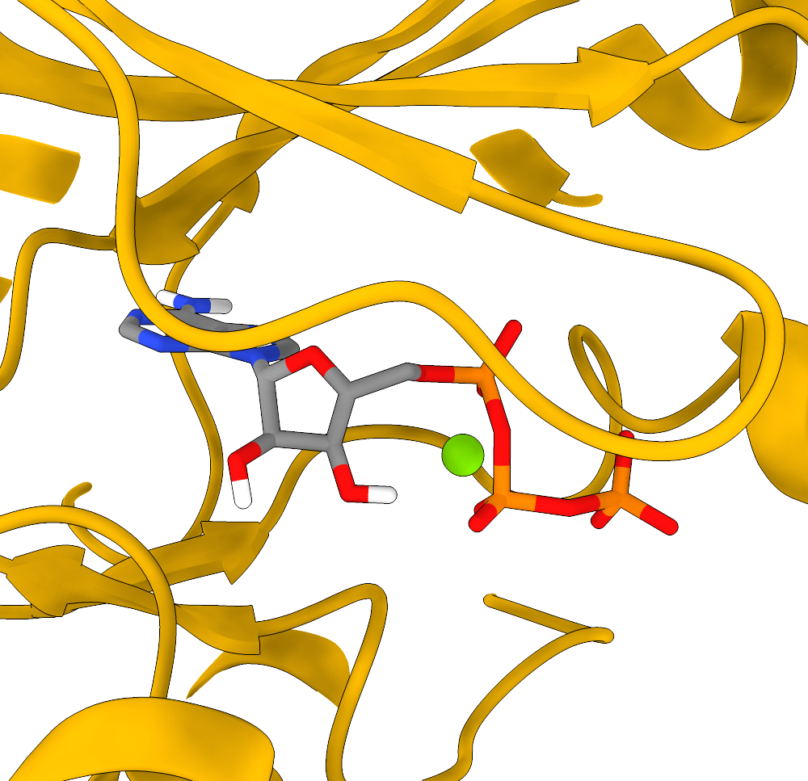
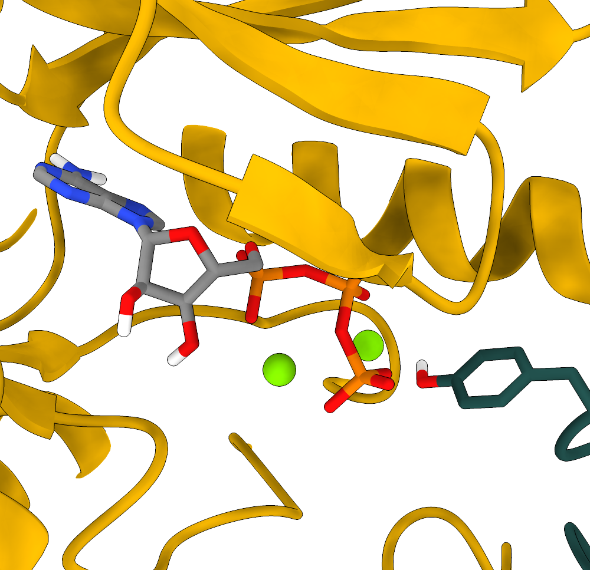

::: {.panel-tabset}

## Introduction

#### Introduction
In this exercise you will set up and run the simulations boxes of a dimer system part of the RAS-RAF-MEK-ERK mitogen-activated protein kinase pathway. This pathway consists in a series of cascade events where the upstream kinase, e.g. RAS, activate by phosphorylation its downstream one, in this case RAF, which in turn can phosphorylate MEK, and so on, in a typical phosphorylation chain that propagates intracellularly an extracellular signal. The misregulation of these communication chains is linked to many pathologies, particularly cancer, and as such deepen their understanding is pivotal in the development of new drug candidates.

Given the importance of this pathway, several PDB structures have been deposited during the years, but they rarely solved the dimeric active structures with their endogenous ligand, ATP. The reason is that these signalling proteins form very ephemeral dimers, as their role is mainly to phosphorylate the downstream kinase and propagate the signal. A stable long-lived interface would both hinder the interaction of the downstream kinase with its next target and slow down the phosphorylation rate of the upstream kinase. Luckily for you, our partners at [EMBL](https://www.embl.org/groups/mccarthy/) were able to solve the structure of the very end of this pathway via cryo-EM [@von2026molecular]. Thus, here you will focus on their MEK-ERK dimer structure, specifically the human MEK1 (UNIPROT [Q02750-1](https://www.uniprot.org/uniprotkb/Q02750/entry#Q02750-1)) and the human ERK2 (UNIPROT [P28482](https://www.uniprot.org/uniprotkb/P28482/entry)).

::: {#fig-mekerk-cryo-panel}


3D cryo-EM density maps and corresponding fitted structures of the (a) inactive, (b) pre-active, and (c) active states of MEK1-ERK2 complex from [@von2026molecular].

:::

You can take a look at the super cool different dimer states with their corresponding cryo-EM densities in @fig-mekerk-cryo-panel. To resolve these structures, the proteins have been modified. Briefly, MEK1  (the upstream kinase, in yellow) has a double S218D and S222D mutation to mimic the upstream activating phosphorylation event. Moreover, its N-terminal, which embraces ERK2, is mutated to that of another organism (GRA24KIM, in violet), to stabilize the dimer. Instead, ERK2 (the downstream kinase, in green) has a single T185V point mutation to stabilize its population. The crystals have been solved with an analogue of ATP and in presence of magnesium, the natural coordinating ion in these systems.

In the structures here provided, MEK1 is still mutated both at its phosphorylation site and at its N-terminal. ERK2, instead, has been back-mutated to the human wild type. In the binding sites you will find ATP, not the analogue, with the corresponding coordinating metal ions (Mg2+) and water. For more details, you can (and <u>should</u>) read the main paper from which these structures are taken [@von2026molecular].

## Set-up

#### A look into the starting files

First of all, start by downloading the exercise directories from the github repository. We provide two different systems, that is the MEK1-ERK2 dimer complex in both active and inactive states, the difference being the number of Mg2+ ions in MEK1 and the state of its activation A-loop. You should download and run simulations of both of them so that you can compare the structures at the end of the molecular dynamics simulation.

<div class="download-buttons">
  <a href="https://github.com/obzehn/advanced_modelling_for_pharma/raw/main/material/MEKERK_inactive_exercise.tar.gz" class="btn">
    
    <span>Download MEK1-ERK2<br>inactive</span>
  </a>

  <a href="https://github.com/obzehn/advanced_modelling_for_pharma/raw/main/material/MEKERK_active_exercise.tar.gz" class="btn">
    
    <span>Download MEK1-ERK2<br>active</span>
  </a>
</div>

You can unzip the downloaded directories with the command

```bash
tar -xvf name_of_compressed_file.tar.gz
```

The individual directories of the different protein/ligand systems are organized as in the following

```bash
MEKERK_active/inactive_exercise
│   ionize.mdp
│   reference_topology_MEKERK_active/inactive.gro
│   reference_topology_MEKERK_active/inactive.top
│   sbatch_me_MEKERK_active/inactive.sh
│
└─── forcefield
│   │   [various forcefields files]
│
└─── step1_em
│   │   em.mdp
│
└─── step2_nvt
│   │   [various nvt.mdp files]
│
└─── step3_npt
│   │   [various npt.mdp files]
│
└─── step4_prod
    │   prod.mdp
```

Going by order, you can see

- The `ionize.mdp`, `reference_topology_MEKERK_active/inactive.gro`, and `reference_topology_MEKERK_active/inactive.top` files. These are the building blocks to set up your starting configuration. These will be covered in depth later in the tutorial.

- A `sbatch_me_MEKERK_active/inactive.sh` file. This is a text file that contains the set of instructions that will run your starting configuration through energy minimization, NVT, NPT, and eventually the production phase.

- A `forcefield` directory. Inside this, you can find several text files that define 'numerically' the key components of your system. You might recognize some of them, like `topol_MEK1DDGRA.itp`, the water model `tip4pd.itp`, and the endogenous ligand `topol_ATP.itp`. You can peek inside them and take a look at how a molecule is described numerically in MD simulations. The format of these files - that is, how these numbers are organized and reported - depends on the software you are using. Since in this course you use GROMACS, these files are written in GROMACS format. However, while these numbers and these files might be different for other software, the core idea of numerically representing with specific functions the intra- and inter-molecular interactions is paramount in molecular dynamics.

- The `step1_em`, `step2_nvt`, and `step3_npt` directories. Inside each of these you can find one or more `mdp` (molecular dynamics parameters) files that will be used to compile and run the energy minimization, the NVT, and the NPT equilibrations. These will be run sequentially by the script `sbatch_me_MEKERK_active/inactive.sh`, taking your starting configuration through a set of equilibration phases to relax the starting configuration gradually and avoid the system exploding.

- The `step4_prod` directory. Here there is the `prod.mdp` file, which is the final mdp file for the production run of the system. This is usually the longest part of the simulation, which can take 3 to 5 days on Baobab depending on the system. The final output files of the simulation will be inside this directory, and the analysis for the exam will mainly revolve around the `prod.xtc` trajectory file.

The idea of this tutorial is to give you the main ingredients to build your own solvated simulation box without going through the hassle of finding a good target to simulate, fix the experimental structure files, find a consistent force field to describe the system, and embedding the protein in the membrane. Considering this, inside the main directory you can find a copy of three files which will be the basic blocks to build the system, namely

- `ionize.mdp`, the mdp file to add the ions in the system;

- `reference_topology_MEKERK_active/inactive.gro`, the starting structure that contains the structure of the MEK1-ERK2 dimer in its active or inactive configuration;

- `reference_topology_MEKERK_active/inactive.top`, the starting topology of the system.

From these, and by using as reference the [Lysozyme in water](http://www.mdtutorials.com/gmx/lysozyme/) tutorial for solvation and ion addition, you should be able to obtain two files, the starting configuration of the solvated protein, which you will name `start.gro`, and the updated topology of the system, which you will name `topol.top`. These files will be then picked up by the `sbatch_me_MEKERK_active/inactive.sh` script and used as starting point to run the equilibration and the production runs of the system.

::: {.callout-note}
## Note
This tutorial shows the set-up of the simulation box by using as example the inactive structure. Nevertheless, the logic of the procedure is identical and can be applied directly to the active state as well.
:::

#### Preparing the HPC environment

Login into Baobab and send the directory with the exercises to your home in Baobab (with `scp`), or directly download it there (with `wget`). Then, request a node with and interactive job for a couple of hours with `salloc` in the following way

```bash
salloc --ntasks=1 --cpus-per-task=4 --partition=private-gervasio-cpu --time=120:00
```

Finally, source the GROMACS installation

```bash
module load GCC/14.3.0
module load OpenMPI/5.0.8
module load GROMACS/2025.3-CUDA-12.9.1
```

and verify that the sourcing was okay by typing

```bash
gmx --version
```

You are now ready to assemble the starting configuration of your system.

::: {.callout-note title="Hardware"}
Notice how here you are requesting 4 CPUs but no GPU, differently from the HPC tutorial (in fact, you are on `--partition=private-gervasio-cpu`). In this case, you are going to use the allocation on Baobab just to set up the box and not to run the simulation, so the GPU is not needed.
:::

::: {.callout-tip title="Read the manual"}
GROMACS has a lot (> 100) of tools that are accessible by typing `gmx` followed by a keyword. In this tutorial you will use `solvate`, `grompp`, `genion`, and `make_ndx`. If you have any doubts remember that you can look online for the explanation of the tool and which flags are needed (`-f`, `-o`, `-s` etc.). For example, [this](https://manual.gromacs.org/current/onlinehelp/gmx-solvate.html) is the manual page of `gmx solvate`. All this information is also available on the spot if you type `-h` or `--h` (for *help*) after the tool's name, e.g., `gmx solvate --h`.
:::

## Box definition

#### Building the starting box

At the beginning, you can take a look at the starting topology (`reference_topology_MEKERK_inactive.top`) and the starting configuration to solvate (`reference_topology_MEKERK_inactive.gro`). The topology reads like this

```C++
; Include forcefield parameters
#include "./forcefield/forcefield.itp"

; Include chain topologies
#include "./forcefield/topol_MEK1DDGRA.itp"
#include "./forcefield/topol_ERK2WT.itp"

; Include ligand topologies
#include "./forcefield/topol_ATP.itp"

; Include water topology
#include "./forcefield/tip4pd.itp"

; Include topology for ions
#include "./forcefield/ions.itp"

[ system ]
; Name
MEK1DDGRA - ERK2WT inactive

[ molecules ]
; Compound        #mols
MEK1DDGRA           1
ERK2WT              1
ATP                 2
mMg                 3
SOL                11
```

First of all, notice that there are lines starting with a semi-column `;`. These are **comments**, that is, lines that are not read by GROMACS. Comments are used to annotate the files and write down details that are helping you - the user - remember what you are doing, what is the meaning of some variables, etc. They are ignored by the software and should be informative for the person writing or for the person supposed to read the code. Feel free to write your own comments, if it helps you, just remember to put a `;` at the beginning of each line that you do not want to be read by GROMACS, otherwise you will receive a fatal error.

Following up, the `#include` statements tell GROMACS where to find the elements of the force field. As can be seen, they are collected inside the `forcefield` directory and must appear with a specific order. First, the set of parameters defining the force field (`forcefield.itp`). Then, the definition of the individual molecules (`topol_MEK1DDGRA.itp`, `topol_ATP.itp`, etc.) that will populate your system. These do not have to appear in a specific order, however <ins>all</ins> the molecules that you intend to use <ins>must</ins> be defined here. Building the topology, that is, filling in this file, is roughly the equivalent of running `gmx pdb2gmx` on the pdb file of the protein, as you did in the Lysozyme tutorial. In this case the system is much more complex and the pdb needs further handling. After the `#include` statements, there is the `[ system ]` section, which is simply the name of the system. It is worth giving the system a meaningful name to help in recognizing the systems in the future.

Finally, there is the `[ molecules ]` section, which must contain <ins>all</ins> the molecules of the system <ins>in the order in which they appear in the box</ins>. Notice that, for the time being, the topology contains the dimer protein (`MEK1DDGRA` and `ERK2WT`), two ligands (`ATP`), three magnesium ions (`mMg`), and eleven water molecules (`SOL`). The whole complex ATP + magnesium + coordinating H2O molecules is the correct physiological state of the ATP-bound state of this protein, since ATP doesn't bind without the positive metal ion and the corresponding water molecules.

GROMACS (and other modelling software) doesn't know if a ligand necessitates some ions and/or coordinating water molecules. Thus, they are placed as part of the initial box **before** the solvation as they have been modelled already in the correct state. This is where the biological and chemical knowledge of the user is critical for building a physiologically correct system.

The binding sites of the inactive dimers are shown in the panels of @fig-mekerk-start.

::: {#fig-mekerk-start}

::: {.panel-tabset}

<!-- --->

## MEK1DDGRA


## ERK2WT


:::

ATP molecules in the binding sites of the inactive starting structure of the MEK1-ERK2 dimer.
:::

Now, take a look at the starting configuration `reference_topology_MEKERK_inactive.gro`. The `.gro` file has a fixed format, and it is better to not modify it by hand if you are not completely sure about what you are doing. The top of the file looks like this

```bash
MEK1DDGRA - ERK2WT inactive
11923
    1MET      N    1   6.545   8.163   8.636
    1MET     H1    2   6.643   8.141   8.635
    1MET     H2    3   6.537   8.241   8.572
    1MET     H3    4   6.519   8.201   8.727
    1MET     CA    5   6.467   8.048   8.583
    1MET     HA    6   6.501   7.963   8.642
    1MET     CB    7   6.316   8.051   8.607
    1MET    HB1    8   6.274   8.136   8.552
[...]
```

The first line contains the title of the box (`MEK1DDGRA - ERK2WT inactive`), the second line contains the number of the atoms in the box (`11923`), and the following ones report in order all the atoms of the system. These are organized usually as nine columns. The first (here `1MET`) is the specific number and name of the residue, which in this case is the N-terminal of MEK1 (and so the first amino acid of the GRA mutation). The second column contains the specific name of the atom, and usually the first letter indicates the element (here you have a nitrogen followed by three hydrogen atoms, a carbon atom, another hydrogen, and so on). The third is simply the number of the entry. It always starts with `1` and goes up to the number of elements in the box. Then, columns four to six contain the x, y, and z coordinates of that atom, while the columns seven to nine, if present, contain its velocity, reported by axial component. Here you can see that the velocities are not reported, and so you have only six columns. All atoms must always have a position, but might have zero or undefined velocity. This is the case now, as you are building the box from a static experimental image. One of the main roles of the equilibrations phase is this - to relax the starting positions and assign reasonable starting velocities to all the atoms.

At the other end of the file, the last lines look like this

```bash
[...]
  401SOL     MW11915   9.561   9.338   3.255
  402SOL     OW11916   7.872   9.057   5.895
  402SOL    HW111917   7.803   8.995   5.870
  402SOL    HW211918   7.903   9.093   5.812
  402SOL     MW11919   7.867   9.054   5.880
  403SOL     OW11920   8.049   9.063   6.123
  403SOL    HW111921   7.970   9.063   6.177
  403SOL    HW211922   8.097   9.142   6.149
  403SOL     MW11923   8.045   9.073   6.134
  0.00000   0.00000   0.00000
```

The meaning of the columns is the same as before. The last molecules to appear are the two water molecules (and in fact, in the topology file, they are reported last). Notice also how this water model (namely included with `tip4pd.itp` in your topology file) has four atoms to describe the molecular nature of water.

The last line of a `.gro` file has, like the first two, a special meaning, as it reports the side length of the box along x, y, and z. Sometimes it can have more than three numbers for particular box shapes. You can see how this box is actually undefined - GROMACS keeps this line used, as it has a special role, but it is filled with zeros. Thus, you will need to define a box before solvating the system.

You can now set up the box by using `gmx editconf`

```bash
gmx editconf -f reference_topology_MEKERK_inactive.gro -o reference_topology_MEKERK_inactive_boxed.gro -bt dodecahedron -c -d 1
```

Here you are starting from the reference structure (`-f reference_topology_MEKERK_inactive.gro`) and asking GROMACS to position your protein in the centre (`-c`), build a dodecahedron box (`-bt dodecahedron`), and make sure that the protein is at least 1 nm distant (`-d 1`) from the box sides to avoid periodic boundary conditions (PBCs) artifacts. Please note that, exactly because of PBCs, there is not a real centre of the box, and positioning the protein in it with `-c` is mostly for representation purposes rather than real physics. 

Differently from the Lysozyme tutorial, here you are also specifying the geometry of the box. In terms of simulations results, the outcome should not depend on the dimension or shape of the simulation box, as long as it is large enough to accommodate the contents (the protein in this case) and avoid self-interaction between PBC images. So, why bother changing the shape or dimension? Why don't just make a huge cube? A hint should come from one of the last lines of the output of `gmx editconf`, which will look something like this

```bash
new box volume  :1407.75               (nm^3)
```

If you try now to build the same system (but <u>do not use it</u>) by specifying a cubic (`-bt cubic`) box, you will end up with something like this

```bash
new box volume  :1631.90               (nm^3)
```

This means that you will have a roughly ~15% larger box, and so more water to solvate, a higher number of molecules to simulate, and consequently much slower simulations.

## Solvating

#### Solvating

Before running `gmx solvate`, you have to know which water model you want to use. For this force field, as also reported in the `reference_topology_GPCR_structure_1.top` file, the model is [TIP4PD](https://en.wikipedia.org/wiki/Water_model) (you are importing the parameters with this line `#include "./forcefield/tip4pd.itp"`), a four-point water model. This means that each water molecule in your simulation will be actually represented with four sites: one oxygen atom (`OW`), two hydrogen atoms (`HW1` and `HW2`), and a dummy site (`MW`) near the oxygen atom that has negative charge. This dummy atom is a numerical trick to better represent the distribution of charge of the lone pair in water's oxygen. To access four-points water models, the flag name for `gmx solvate` is `-cs tip4p.gro`.

Thus, you can solvate the system with the following

```bash
gmx solvate -cp reference_topology_MEKERK_inactive_boxed.gro -cs tip4p.gro -o reference_topology_MEKERK_inactive_solvated.gro
```

where you are asking to add water to the structure with `-cp reference_topology_MEKERK_inactive_boxed.gro`, use as reference a three-points water model with `-cs tip4p.gro`, add call the resulting output structure `-o reference_topology_MEKERK_inactive_solvated.gro`. Some of you may notice that in the Lysozyme tutorial you also have to pass the topology of the system with the `-p` flag. This is not mandatory, and has the advantage that the updated topology would have the same name as the input one, which makes harder to trace back after possible errors. However, if you don't pass the topology then you will have to update it by hand to include the presence of the water molecules.

The (last lines of the) output of this command will look something like this

```C++
[...]
Volume                 :     1407.75 (nm^3)
Density                :     1011.03 (g/l)
Number of solvent molecules:  42535
```

GROMACS tries to fill the box with water to reach the density of ca. 1 g/L. The most important part here is the number of water molecules inserted, in this case `42535` (this number can oscillate slightly, as molecules are randomly inserted). You now has just to add this number at the end of the topology to tell GROMACS that the content of the box has changed.

First, copy the reference topology

```bash
cp reference_topology_MEKERK_inactive.top reference_topology_MEKERK_inactive_solvated.top
```

Then, add the amount of water molecules to `reference_topology_MEKERK_inactive_solvated.top` by correcting the `[ molecules ]` section in the following way

```C++
[...]
[ molecules ]
; Compound        #mols
MEK1DDGRA           1
ERK2WT              1
ATP                 2
mMg                 3
SOL             42546
```

You have to add the name of the water in the box (`SOL`) and the number reported after tunning `gmx solvate`. Here, `SOL` was already reported as there are a few water molecules coordinating the Mg ion, and as such you just have to add two to the total solvation number.

At this point, the structure of the solvated system is contained in `reference_topology_MEKERK_inactive_solvated.gro`, while its topology in `reference_topology_MEKERK_inactive_solvated.top`.

## Adding Ions

#### Adding ions

You are now ready to add the ions in the system. First, you need to generate a `.tpr` file, which is a binary file that GROMACS can read to understand the charges of the different molecules in the system and select automatically how many ions should be added. You can do this by using `gmx grompp` and pointing to the parameters file `ionize.mdp` with the flag `-f`, to the starting solvated structure `reference_topology_MEKERK_inactive_solvated.gro` with the flag `-c`, to the solvated topology `reference_topology_MEKERK_inactive_solvated.top` with the flag `-p`, and finally name the output tpr file `ionize.tpr` with the flag `-o`

```bash
gmx grompp -f ionize.mdp -c reference_topology_MEKERK_inactive_solvated.gro -p reference_topology_MEKERK_inactive_solvated.top -o ionize.tpr
```

You might see (depending on GROMACS version) that for some systems this command fails with a fatal error containing the following information

```bash
NOTE 2 [file reference_topology_MEKERK_inactive_solvated.top, line 27]:
  System has non-zero total charge: -14.000000
  Total charge should normally be an integer. See
  https://manual.gromacs.org/current/user-guide/floating-point.html
  for discussion on how close it should be to an integer.

WARNING 1 [file reference_topology_MEKERK_inactive_solvated.top, line 27]:
  You are using Ewald electrostatics in a system with net charge. This can
  lead to severe artifacts, such as ions moving into regions with low
  dielectric, due to the uniform background charge. We suggest to
  neutralize your system with counter ions, possibly in combination with a
  physiological salt concentration.

```

Basically, a tpr file is used to run simulations. As such, when GROMACS tries to prepare one through `gmx grompp`, it checks if the physics of the system is reasonable or not. In this case, it found that your system has a net charge of -14, and is telling you that this is very bad as the systems should always have zero total net charge. You can bypass this check by adding the flag `--maxwarn 1` to the command, that is, ignore one (and only one) warning

```bash
gmx grompp -f ionize.mdp -c reference_topology_MEKERK_inactive_solvated.gro -p reference_topology_MEKERK_inactive_solvated.top -o ionize.tpr --maxwarn 1
```

You will see that now GROMACS still complains, but gets the job done. It is very important, however, to understand that the ionization step is nearly the **only** case in which it is okay to use the `--maxwarn` flag, as you **know** that the physics of the system is wrong and you actually need the tpr to fix it with `gmx genion`.

::: {.callout-warning title="Silencing warnings"}
You may be temped to use `--maxwarn` to get through errors, but generally <u>you should never use this flag without understanding the problem</u>. If there is a major warning then you have to check what is happening. With `--maxwarn` you can compile the binary but the simulation will probably fail instantly the moment you try to run it, or, worse, it will run but you are likely to produce garbage results due to overlooking fundamental physics mistakes in the box preparation.
:::

Now, you should have a `ionize.tpr` file in your directory, following the `gmx grompp` command. You are ready to insert the ions with the following command

```bash
gmx genion -s ionize.tpr -neutral -pname NA -nname CXY -conc 0.15 -o start.gro
```

Here, you are asking GROMACS to make the system neutral (`-neutral`), call the positive ions `NA`, the negative ions `CXY`, reach a physiological salt concentration of 0.150 mol/liter (`-conc 0.15`), and call the resulting output `start.gro`. Trivially, within this force field the atoms `NA` and `CXY` refer to sodium (Na, +1) and chlorine (Cl, -1) ions (in particular this chlorine has a special re-parametrisation due to the Mg ions used in the force field). Again, differently from the Lysozyme tutorial, you are not giving as input the topology and you will update it after the addition of ions.

With `genion`, GROMACS tries to substitute some molecules in the system with the necessary number of ions. You will be promted by GROMACS to choose which part of the system you are okay to substitute in favour of water molecules

```bash
Will try to add 141 NA ions and 127 CXY ions.
Select a continuous group of solvent molecules
Group     0 (         System) has 182063 elements
Group     1 (        Protein) has 11790 elements
Group     2 (      Protein-H) has  5884 elements
Group     3 (        C-alpha) has   737 elements
Group     4 (       Backbone) has  2213 elements
Group     5 (      MainChain) has  2952 elements
Group     6 (   MainChain+Cb) has  3642 elements
Group     7 (    MainChain+H) has  3645 elements
Group     8 (      SideChain) has  8145 elements
Group     9 (    SideChain-H) has  2932 elements
Group    10 (    Prot-Masses) has 11790 elements
Group    11 (    non-Protein) has 170273 elements
Group    12 (          Other) has    89 elements
Group    13 (            ATP) has    86 elements
Group    14 (            mMg) has     3 elements
Group    15 (          Water) has 170184 elements
Group    16 (            SOL) has 170184 elements
Group    17 (      non-Water) has 11879 elements
Select a group:
```

From the first line you can see that GROMACS understood that the system has a total of -14 charge and will then need fourteen positive ions to have a total of zero net charge plus other ions to reach the given salt concentration. Since you do not want to substitute any part of the protein or the ligand, choose the `SOL` group, and GROMACS will randomly pick seven water molecules, remove them and place there a sodium ion.

```bash
Select a group: 16
Selected 16: 'SOL'
Number of (4-atomic) solvent molecules: 42546
Using random seed -276512898.
Replacing solvent molecule 6763 (atom 38931) with NA
Replacing solvent molecule 8705 (atom 46699) with NA
Replacing solvent molecule 42156 (atom 180503) with NA
[...]
Replacing solvent molecule 11490 (atom 57839) with CXY
Replacing solvent molecule 16679 (atom 78595) with CXY
```

As for the solvation, you need now to update the topology as some water molecules have been removed and some sodium ions have been added. Start by copying the solvated topology into a new topology called `topol.top`

```bash
cp reference_topology_MEKERK_inactive_solvated.top topol.top
```

and change the `[ molecules ]` section by removing the same number of water molecules from the total and adding the the sodium (`NA`) and chloringe (`CXY`) ions, in this case then we need `141 NA`, `127 CXY`, and remove `141+127=268` water molecules.

```C++
[...]
[ molecules ]
; Compound        #mols
MEK1DDGRA           1
ERK2WT              1
ATP                 2
mMg                 3
SOL             42278   ; before ionization it was 42546
NA                141
CXY               127
```

Summarizing, you now have the starting solvated and neutralized configuration stored in `start.gro` and the corresponding topology in `topol.top`. You can take a look at the final system with VMD. It should look similar to that shown in @fig-mekerk-box.

::: {#fig-mekerk-box}


Final solvated dodecahedron box for the inactive MEK1-ERK2 inactive system. MEK1 and ERK2 are in a yellow and green cartoon representation, respectively. ATP is represented as sticks. Water is represented as a transparent soft blue surface. Ions are represented with their van der Waals radii and are in and violet (sodium and chlorine) and green (magnesium).

:::

## Dynamics

#### A look at the `sbatch_me.sh` file
The content of the exercise directory should now be similar to this

```bash
PKG_APO/HOLO_X_exercise
│   sbatch_me.sh
│   start.gro
│   topol.top
│
└─── forcefield
│
└─── step1_em
│   │   em.mdp
│
└─── step2_nvt
│   │   [various nvt.mdp files]
│
└─── step3_npt
│   │   [various npt.mdp files]
│
└─── step4_prod
    │   prod.mdp
```

plus some leftover files from the system generation. It is mandatory that `sbatch_me.sh`, `start.gro`, and `topol.top` are together in the same directory in which there are the energy minimization, NVT, NPT, and production directories, otherwise the script `sbatch_me.sh` won't be able to run the simulations for you.

During both the Lysozyme tutorial and the preparation of the box for this exercise, you logged in a Baobab node by using the `salloc` command. In this way you can have access to a node and run an interactive job. This is nice because you can have real time answers from the node and you see clearly what is going on and what you are doing, which is pivotal for error-prone procedures like the generation of the starting box. However, when you close the connection, log out from Baobab, or simply turn off the computer, you lose the access to the computer and any running simulation will stop. Does this mean that you should be always connected? And that you should stay constantly in front of your computer, even for a few days at a time, while the simulations run, scared or losing the internet connection and see your runs fail?

Clearly this is not the case. As explained also in the [Introduction to HPC](/introduction_baobab.qmd), Baobab has a so-called queueing system, named [slurm](https://slurm.schedmd.com/overview.html). With slurm, you can prepare a *submission script* that contains the main commands that you want to run alongside the resources that you need. This is exactly what the `sbatch_me.sh` script is.

Take a look at the content of the `sbatch_me.sh`. The first lines look like this

```bash
#!/bin/bash 

#SBATCH --account=gervasio_teach_19h330
#SBATCH --partition=private-gervasio-gpu
#SBATCH --time 144:00:00
#SBATCH --job-name PKG_ANP
#SBATCH --error jobname-error.e%j
#SBATCH --output jobname-out.o%j
#SBATCH --ntasks 1
#SBATCH --cpus-per-task 16
#SBATCH --nodes 1
#SBATCH --gpus-per-node=nvidia_geforce_rtx_3080:1
#SBATCH --hint=nomultithread

[...]
```

You can recognize some of the flags that you were giving to the `salloc` command, such as `--partition=private-gervasio-gpu` and `--cpus-per-task 16`. Basically these lines are specifying which kind of hardware you need to run the simulations. If you are curious, you can look up their meaning in the slurm website.

Slurm reads this files and sends you in a queue while it waits to find some computer that is available and that has the requested hardware. When it finds it, it takes control of it for the amount of time specified in `--time 144:00:00`, that is, six days. This amount of time will be sufficient to both conclude the equilibration and the production runs.

Continuing along the `sbatch_me.sh` script, as in the interactive case, the first thing to do once the node is allocated is to source GROMACS, which is the first thing done by the script with the lines following the `#SBATCH` node requests, i.e., with the following

```bash
[...]
module load GCC/14.3.0
module load OpenMPI/5.0.8
module load CUDA/12.9.1
module load GROMACS/2025.3-CUDA-12.9.1
[...]
```

Then there are a few technical details about how GROMACS should use the available resources to run the simulations with `gmx mdrun` (e.g. `-ntmpi`, `-ntomp`, etc.).

Lastly, there are a series of commands that enter with `cd` the `step1_em`, `step2_nvt`, `step3_npt`, and `step4_prod` directories and systematically run `gmx grompp` to prepare the corresponding tpr files and then run them with `gmx mdrun`.

You can send the submission script `sbatch_me.sh` and let slurm handle the simulations by using the [sbatch](https://slurm.schedmd.com/sbatch.html) command. This should be run from Baobab's head-node, and not from the node that you received by running `salloc`. Thus, from the `PKG_APO` or `HOLO_X_exercise` directory where the submission script `sbatch_me.sh` is located, you can submit the job slurm with the following command

```bash
sbatch sbatch_me.sh
```

If the command runs successfully, slurm returns the number that is assigned to your job, something like this

```bash
Submitted batch job 16568567
```

You can check the status of the job by running (and substituting `username` with yours)

```bash
squeue -u username
```

The output will look something like this

```bash
             JOBID PARTITION     NAME     USER ST       TIME  NODES NODELIST(REASON)
          16568567 private-g    PKG_ANP username  R       2:11      1 gpu039
```

The `R` under the column `ST` (for *status*) stands for *running*. Usually, the job stays in the queue with some other status, like `PD` (for *pending*), before changing to `R`. Once it's running, you will see that slurm directly writes the output to the exercise directories, e.g., you will see `em.gro`, `em.trr`, and other output files appearing in `step1_em`, `nvt_1.log`, `nvt_1.gro` etc. in `step2_nvt`, and so on. Now that the job is submitted and running, you can log out from Baobab without risking to stop it. For the malaria target exercises, the time needed to complete the whole equilibration phase (steps 1 to 3) is of about two hours, while to complete the production it will take roughly two days, so a total of two days overall.

#### A look at the process of equilibration

Differently from the Lysozyme tutorial, here you can see that the NVT and NPT simulations are not unique, but they consist of several steps each, which are run one after the other. For the sake of completeness, you can take a look at the various `nvt_X.mdp` and `npt_X.mdp` files. As for the other files, the lines starting with `;` are comments, that is, they are ignored by GROMACS and are useful only for human readers to organize the code.

Let's take a look at a few key entries in the mdp file.

```bash
[...]
;---------------------------------------------
; INTEGRATOR AND TIME
;---------------------------------------------
integrator               = md
dt                       = 0.002
nsteps                   = 50000
[...]
```

Here you are asking GROMACS to use a [leapfrog integrator](https://en.wikipedia.org/wiki/Leapfrog_integration) by setting `integrator = md`. The integration is performed with a time step `dt` of 0.002 ps, that is, 2 fs, which is the standard for this type of simulations. Lastly, the integration is performed for 50000 steps, as set by `nsteps`, that is, `50000 x 0.002 ps = 100ps`. You can see that the number of steps is relatively short with respect to the production run, as reported in the `prod.mdp` parameters file.

The other most important section is the one where you set the thermostat and barostat settings. For the NVT runs, you have the thermostat that controls the temperature and the parameters look something like this (here taken from `nvt_6.mdp`)

```bash
[...]
;----------------------------------------------
; THERMOSTAT AND BAROSTAT
;----------------------------------------------
; >> Temperature
tcoupl                   = v-rescale
tc-grps                  = Protein non-Protein
tau_t                    = 0.5     0.5
ref_t                    = 300     300
; >>  Pressure
pcoupl                   = no
[...]
```

The thermostat is connected separately to the two phases of your system. As for the GPCRs systems, the components in the box are coupled separately to the thermostat to achieve better thermostatting (as specified by `tc-grps`). However, differently from the GPCR exercise, you didn't have to produce an index file here because the names you are using for the groups are standard ones that are automatically recognized by GROMACS. Notice how there is no pressure coupling (`pcouple = no`). For the NPT runs, instead, the barostat is activated and the box can oscillate and change its volume. You can see the parameters of the barostat in the `THERMOSTAT AND BAROSTAT` sections for any of the `npt_X.mdp` files.

```bash
[...]
; >>  Pressure
pcoupl                   = C-rescale
pcoupltype               = isotropic
tau-p                    = 1.0
compressibility          = 4.5e-5
ref-p                    = 1.0
[...]
```

The reason why there are several NVT and NPT sub-phases is that the system should be relaxed gradually, otherwise it might distort the starting configuration, which would be detrimental - if not deadly - for maintaining the correct binding pose of the ligand. This can be achieved by putting so-called *restraints* on specific atoms of the system to restrain them in space, that is, to not let them move too much. This behavior is controlled by the parameters defined under the `POSITION RESTRAINTS` section, as in the following example taken from `nvt_1.mdp`

```bash
[...]
;---------------------------------------------
; POSITION RESTRAINTS
;---------------------------------------------
define                    = -DPOSRES_PRO -DPOSRES_FC_SC=500 -DPOSRES_FC_BB=1000 -DPOSRES_IONS -DPOSRES_MG=1000 -DPOSRES_LIG=1000
[...]
```

The technical implementation and the specific meaning of these parameters is beyond the scope of this tutorial. The take at home message is that, due to the restraints, at the beginning both the ligand and the protein (and the MG ion for the ANP system) can't really move freely in space, but water can. In this way you can thermalize first the water molecules. Then, gradually, the restraints on the atoms of the system are decreased to let the whole system equilibrate. You can check the values of the parameters in the `POSITION RESTRAINTS` of the `nvt_X.mdp` and `npt_X.mdp` files. You will see that they gradually decrease up to disappearing in the last NPT equilibration. You can also see that the `nvt_X.mdp` files actually have an increasing temperature, so that the system is thermalized gradually to avoid distortions of the experimentally-resolved binding site.

The production run is usually simulated without restraints at all, and in fact there is no restraint defined in `prod.mdp`, as you would like to simulate the 'natural' behavior of the system. In this tutorial, the [statistical ensemble](https://en.wikipedia.org/wiki/Ensemble_(mathematical_physics)) of the production run is still the isothermal-isobaric ensemble (NPT), as you can see from the `prod.mdp` file since both the thermostat and the barostat are active. It is informally called *production* because it is the part of the simulation that is used most of the times for the analysis, as it comes after the equilibration and it is supposed to be well relaxed.

## Tips and tricks
#### Tips and tricks for handling trajectories

Trajectories are fidgety things. The standard format of the GROMACS trajectory, an `.xtc` file, contains the positions of the atoms as a function of time, collected as a sequence of frames. The frequency of the output is set by the keyword `nstxout-compressed` in the mdp files, in units of time steps. For the protein/ligand productions, this is 10000, that is, `10000 x 0.002 ps = 20 ps`. Considering that the run is long 250 ns, this means that you will collect 12500 frames. The content of the frames is defined by the keyword `compressed-x-grps`. Since this was not set in the mdp files, the default is the whole system, that is, the protein with water and, if present, ligands and ions.

::: {.callout-tip title="Data volume"}
You can imagine how writing coordinates for hundreds of thousands of atoms for thousands of frames can be very memory intensive. Deciding in advance what to print and the frequency is very important, and can save you a lot of space. However, it is better to stay on the safer side as the only way to recover not printed data is to rerun the simulation.
:::

This short section covers a couple of key points in handling trajectories and the representation of periodic boundary conditions. It is important to understand that the information of the trajectory is the same, and changing its representation <u>doesn't change the content</u>. There are a few reasons why post-processing of the trajectory is fundamental. The most important is for analysis purposes, as some tools might be sensible to the representation of the molecules. For example, RMSD calculation might break down and give non-sensical jumps if the tool that calculates it doesn't reconstruct the trajectory by fixing broken molecules across periodic boundaries. Building on this point, very large trajectories are also hard to handle from the hardware perspective, and it is better to reduce them to the strictly necessary so that tools analyzing them are faster. Handling trajectories is important also for representation purposes, e.g., rendering a fancy image for a publication. Moreover, this is connected to understanding via visualization, as watching the trajectory is very important to gain insights on the system and check possible criticalities, and human eyes work better with whole molecules.

The main tool for trajectory handling in GROMACS is [`gmx trjconv`](https://manual.gromacs.org/current/onlinehelp/gmx-trjconv.html). Take a look at the manual for the optional flags and see if anything fits what you want to do (or check with `gmx trjconv --h`). This is a tool that notoriously necessitates some experience to achieve an efficient usage, but it is worth pointing out a few key commands. Generally, after running `gmx trjconv` GROMACS asks some further information (depending on the flags you are using) in terms of contents of the system. The most important thing here is to read properly what GROMACS asks and answer accordingly to your own purpose.

The panels of @fig-malaria-pbc shows a few ways in which the trajectory can be post-processed. The videos were rendered with VMD with PKG shown as a red cartoon ribbon and the ligand as van der Waals spheres. Please consider also that the dodecahedron box is represented internally as a triclinic like box, so the PBC box represented as blue lines read by VMD is different from the animation in the representation. The panels are

- The original trajectory. Molecules that are broken across the boundaries give rise to the typical spaghetti-like bonds. Notice how nothing leaves the box, as the PBCs put the atoms back in the box, but on the other side;

- The trajectory corrected for PBCs broken molecules. This can be achieved with the flag `-pbc mol`. Notice how the protein is now whole, but GROMACS puts it back at the nearest interface with respect to its center, so the protein can 'jump' across boundaries. The ligand can do the same, and sometimes they can be in different position and may seem like the ligand left the pocked;

- The trajectory re-centered around the protein and corrected for PBCs broken molecules. This can be achieved with the flag `-pbc mol` and `-center` and prompting GROMACS to center the protein in the box. Now everything stays in place, but it's very hard to focus on the ligand, as the binding site wobbles constantly;

- The trajectory refitted on the protein first frame of the energy minimization. This comes from two concatenated passages. The first usually is the same as the point before this one, that is, PBC removal and re-centering. Then, the output is further post-produced with `trjconv` by setting the flag `-fit rot+trans`, and prompting GROMACS to use the protein alpha carbons as reference. Briefly, GROMACS tries to match the position of the protein in each frame with the starting one (passed with the flag `-s`). You can see how the protein position is much more consistent and the ligand binding site - with the bound ligand - can be appreciated again.

::: {#fig-malaria-pbc layout-ncol=2}

::: {}
{width="400" fig-align="center"}
:::

::: {}
{width="400" fig-align="center"}
:::

::: {}
{width="400" fig-align="center"}
:::

::: {}
{width="400" fig-align="center"}
:::

The same HOLO with 1TR trajectory re-wrapped in four different ways. PKG is represented as a red cartoon ribbon, while 1TR is represented in van der Waals spheres. Water is removed for clarity. The first panel shows the original trajectory; the second shows molecules made whole across PBCs; the third centers the protein in the box; the fourth aligns the protein to the last frame of the energy minimization. You can see that the ligand was bound for the whole duration of the production.
:::

For the exam, the main post-processing of the trajectory that you might need is the removal of the water molecules, as this will make the trajectory much smaller and easy to download and analyze. It is also worth to correct the PBCs and center the protein, which basically means obtaining what is shown in the third panel of @fig-malaria-pbc. You can do this in one command as in the following

```bash
gmx trjconv -f prod.xtc -s nvt_1.tpr -pbc mol -center -o center_traj.xtc
```

and, when prompted by GROMACS, by selecting the group `Protein` for centering and `System` for output. The output will be called `center_traj.xtc` and will contain the whole trajectory where all the molecules are made whole across the PBCs and the protein is centered in the box. You can then fit the protein to its starting position to better visualize the binding site (like panel 4 of @fig-malaria-pbc) as in the following

```bash
gmx trjconv -f center_traj.xtc -s nvt_1.tpr -fit rot+trans -o center_traj_fit.xtc
```

and selecting the protein C alphas for fit and the `System` for output. Now, `center_traj_fit.xtc` will contain the whole trajectory and after centering and fitting it on the starting configuration of the protein contained in `nvt_1.tpr`. This will probably still be a large file, so you can produce a more manageable file for visualization with VMD with the following two commands

```bash
gmx trjconv -f center_traj_fit.xtc -s em.tpr -o nowater.xtc
gmx trjconv -f center_traj_fit.xtc -s em.tpr -o nowater.gro -dump 0
```

In both cases, select `non-Water` as the output group. These will produce two files, `nowater.gro` and `nowater.xtc`, which are the first frame of the production run and the associated trajectory, respectively, but without the water. The files should be much smaller than the original `prod.xtc`. You can use these two files to visualize the trajectory in VMD. You can get rid of the intermediary files and remove them, that is, `rm center_traj.xtc center_traj_fit.xtc`.

::: {.callout-warning title="Remove carefully"}
Remember that [`rm`](https://ss64.com/bash/rm.html) permanently deletes files. There is no Trash/Recycle bin in the terminal, and if by mistake you delete something that you need, like the production trajectory, you will have to re-run the simulation.
:::

Two major points here. First, notice how the tpr passed to trjconv is `nvt_1.tpr`, the one compiled by the `sbatch_me.sh` script following the energy minimization. This is useful in cases where the refitting and re-centering is very complex due to the presence of more than one molecule which should stay consistent in terms of reference frame. For example, you can see in panel 2 of @fig-malaria-pbc how simply applying a PBC correction with `-pbc mol` might not be enough, as in some frames the ligand is on a side of the box while the protein is on the other, giving the impression that the ligand left the binding site, while this is not the case. Such visualization artifacts can be solved by the usage of a good reference structure (like `nvt_1.tpr`, as in the beginning without dynamics the molecules were still at the centre of the box), some patience, and a good combination of flags (usually `-pbc mol -center` is a good starting point). Secondly, removing water might be a good idea for visualization purposes, but not for analysis ones. What about the interaction of water with the ligand/binding site? Are there any? Are they important? This is very relevant in systems like HOLO + ANP, where the two water molecules coordinating the magnesium ion are part of the physiological ligand-bound state. As such, use with care and keeping in mind what you want to do with the cleaned trajectory.

As a final statement, the process of reducing the trajectory shown in the latter is transferable to whatever you want to output that is contained in the box. You will just have to select the group you want to maintain in the output when prompted by trjconv. If the specific group you want is not among those automatically suggested, you can create a new one with `gmx make_ndx` and pass the index file to `trjconv` via the flag `-n` (the adhesion GPCR exercise has an introduction on index generation). 

:::

## References
