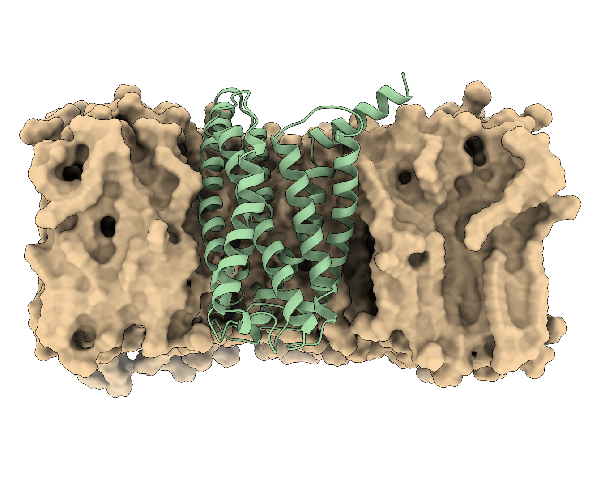
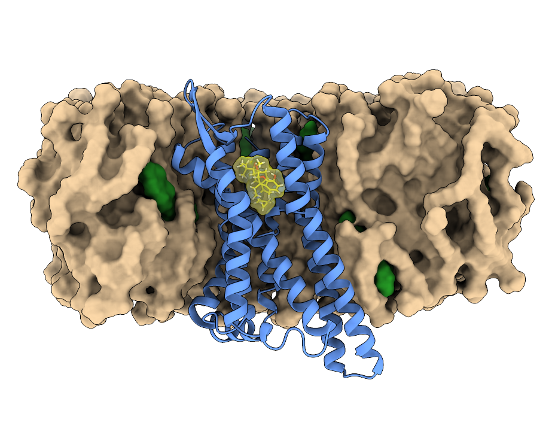

This website is in support of the *Advanced Modelling and Data Analysis for Pharmaceutical Sciences* course for the Master Degree of Pharmacy at the University of Geneva. For more details, questions, and more course material, please refer to the corresponding Moodle page or reach out to the [team](contacts.qmd).

If you are not part of the course, please feel free to use this material freely, but the authors do not take any responsibility or make any claim of correctness on the provided input files.

<h2>Theory</h2>
<ul class="linked-list">

  <li>
    
    

      <a class="title" href="introduction_terminal.qmd">Introduction to terminals</a> 
      A brief introduction to unix/unix-like terminals and shells.
    

  </li>

  <li>
    
    

      <a class="title" href="introduction_baobab.qmd">Introduction to Baobab and HPC</a> 
      Introduction to few key concepts behind High Performance Computing (HPC) and Baobab.
    

  </li>

</ul>

<h2>Exercises</h2>
<ul class="linked-list">

  <li>
    
    

      <a class="title" href="exercise_gpcr_stability.qmd">Adhesion GPCR in membrane</a> 
      Study the dynamical behavior of models of an adhesion GPCR.
    

  </li>

  <li>
    
    

      <a class="title" href="exercise_malaria_targets.qmd">Malaria target with ligands</a> 
      Study APO and HOLO states of the protein kinase G.
    

  </li>

  <li>
    
    

      <a class="title" href="exercise_muOR_ligands.qmd">mu-Opioid receptor in membrane with ligands</a> 
      Study APO and HOLO states of the mu-Opioid receptor systems in a membrane.
    

  </li>

</ul>
