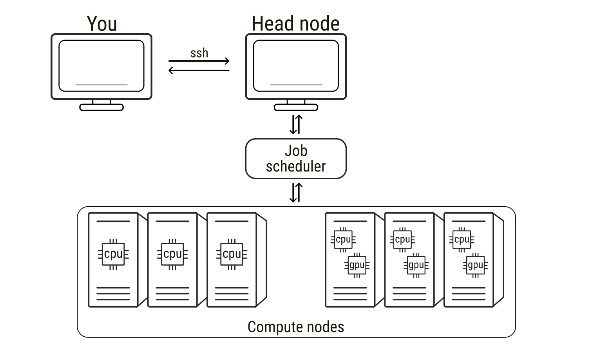
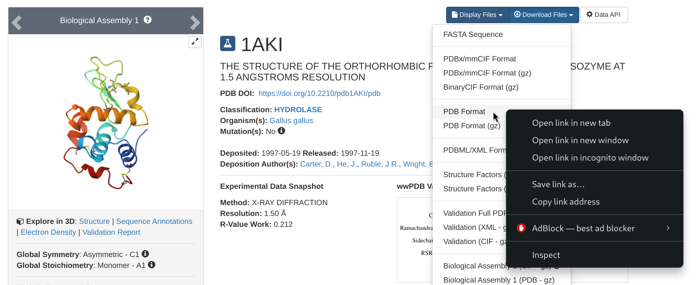

# General considerations
This page is a simple summary of a few key commands to run molecular dynamics (MD) simulations with [GROMACS](https://www.gromacs.org/) on [Baobab](https://doc.eresearch.unige.ch/hpc/start), a high performance computer at the University of Geneva. It has been written as a support for the hands-on session within the *Advanced Modelling and Data Analysis for Pharmaceutical Sciences*. The general concepts about allocating and running jobs can be directly applied to run other MD simulations on Baobab, such as those presented in this excellent [suite of tutorials](http://www.mdtutorials.com/gmx/index.html). At the end of this tutorial, you should be equipped with a basic understanding sufficient to run interactive jobs on Baobab with GROMACS sourced. You are then expected to familiarize with simple systems such as the [*Lysozyme in water*](http://www.mdtutorials.com/gmx/lysozyme/) tutorial, which we will run together during lectures.

::: {.callout-warning}
## Important

As pre-requisite, some familiarity with the Unix and Unix-like terminal environments is <u>strongly</u> suggested. A quick guide is provided here at [Introduction to Terminals](introduction_terminal.qmd).

:::

# High Performance Computing

[High-performance computing (HPC)](https://en.wikipedia.org/wiki/High-performance_computing) refers to the use of powerful computer clusters to solve computational problems that are too large or time-consuming for a single workstation. HPC systems are extremely widespread in all scientific fields, from fluid dynamics of meteorological events to molecular modelling and molecular dynamics simulations. An HPC system is typically composed of many interconnected computers, usually called *nodes*, which can be used alone but can also work together to perform calculations in parallel. When connecting to an HPC service, users usually connect first to a *head node*, the central access point used for logging in, preparing files, and submitting computational tasks. The head node manages the cluster but <u>is not</u> intended for heavy computations. The actual calculations are performed on the *compute nodes*, which provide the [CPUs](https://en.wikipedia.org/wiki/Central_processing_unit), [GPUs](https://en.wikipedia.org/wiki/Graphics_processing_unit), and memory required for simulations. To use these compute nodes, researchers submit a *job*, that is, a request to run a program with specified computational resources. Jobs are managed by a scheduler that allocates nodes and runs tasks when resources become available. In molecular dynamics simulations, a job may involve running a simulation engine for millions of time steps, a process that can require days to weeks to finish. During this time the scheduler software monitors (to some extent) input and output of the jobs. As such, understanding how to prepare and run jobs on HPC systems, as well as requesting the correct type of hardware and being able to leverage it, is essential for efficiently performing large-scale molecular simulations.

{width="600px" fig-align="center"}

# Loading GROMACS on Baobab

## Allocating an interactive job on Baobab
On Baobab, the job scheduler is [slurm](https://slurm.schedmd.com/overview.html), which permits both interactive and non-interactive sessions. Most of the times MD simulations do not necessitate any interactivity. In these cases jobs are submitted by providing a *submission script* to Slurm via the [`sbatch`](https://slurm.schedmd.com/sbatch.html) command. The queueing system will then queue the job and run it as soon as the requested resources are available. However, sometimes for debugging purposed, or to have some direct hands-on experience like in your case now, the jobs can be interactive. This means that Slurm will find the resources requested by the job, allocate them, and log you in on the corresponding node. As such, if you quit the interactive session, e.g. by logging off the allocated node and going back to the head node, the jobs you were running will die and you will have to allocate and queue again to re-open the interactive session.

To connect to Baobab's head node, you need to [`ssh`](https://man.openbsd.org/ssh) to Baobab via the following command (substitute `username` with your username)

```bash
ssh -X username@login1.baobab.hpc.unige.ch
```

Insert your password (note that you won't see your password being typed for security reasons). You should now be logged in on the head node of Baobab, calls `login1`, which is confirmed by the beginning of your terminal line that will look something like this

```bash
(baobab)-[username@login1 ~]$
```

Now you can allocate an interactive job via Slurm by running the following command

```bash
salloc --ntasks=1 --cpus-per-task=8 --gpus=1 --partition=private-gervasio-gpu --time=180:00
```

The flags specify what type of resources you need. There are [many flags](https://slurm.schedmd.com/salloc.html) available in Slurm to describe your necessities and allocate the correct amount of resources for your job. In this case the flags are

* `--ntasks=1` sets the number of [tasks](https://simple.wikipedia.org/wiki/Task_(computers))
* `--cpus-per-task=8` sets the number of CPUs per task
* `--gpus=1` sets the number of GPUs
* `--partition=private-gervasio-gpu` sets the partition that has to be used, that is, the name of the domain where to look for resources
* `--time=180:00` sets the time allocated for the job (in minutes, so three hours)

Slurm will then queue your request. Depending on the queuing situation and on the requested resources, the job should ideally start within a few seconds. You will notice that Slurm changes your location from the head node (`login1`) of the cluster to the allocated GPU node, switch that you can also notice by the change in the terminal line header that now reads as

```bash
(baobab)-[username@gpuxxx ~]$
```

where `xxx` is a number indicating in which GPU node you are logged in.

## Sourcing GROMACS
At this point you are logged in and the GPU node is available to you for the time specified in the previous command or up to when you log out of it. However, the nodes are virgin of any software, as having all programs always available and installed on each node would be useless and impossible to maintain properly. This means that you have to request specifically what type of software you need, which will also depend on the type of node you have allocated. For example, if you want to use software based on GPU acceleration, as with GROMACS in this case, you have to request a node that has GPUs available (you did it with the `--gpus=1` flag). Moreover, if the software has some dependencies, i.e., it relies on other software to work properly, then you have to load those dependencies first. Again, this is the case of GROMACS, which depends on other software to exploit the hardware available on HPC clusters.

Unfortunately, both software and hardware have been growing in complexity over the years, and the zoo of interactions and dependencies has consequently exploded. For the sake of curiosity, you can simply take a look at the [plethora of options](https://manual.gromacs.org/documentation/current/install-guide/index.html) available for the installation of GROMACS. Things get even more complicated when working on HPC clusters, since some of these options are architecture dependent, i.e., they can work on some nodes but not on others, and seldom cannot be solved by “normal” users that lack the permissions to modify core functionalities of the cluster itself. The installation of GROMACS – and of its corollary software – is way beyond the scope of this page, but it is worth taking a look at the complexity of these structures to better appreciate *why* the usage of high throughput scientific software is far from trivial.

Fortunately for you, a GROMACS installation for this tutorial is already available. Thus, it is sufficient to `source` it, that is, to tell to the terminal where GROMACS files are located. Very roughly speaking, this means that you load on your terminal the command keywords that refer to the software you need (if you are curious, just type `gmx --version` on your terminal – what answer do you get?). However, as just introduced, you have to first load GROMACS dependencies, which in this cluster means executing the following commands one after the other

```bash
module load GCC/11.3.0
module load OpenMPI/4.1.4
module load CUDA/11.7.0
```

and lastly load GROMACS with the following

```bash
module load GROMACS/2023.1-CUDA-11.7.0
```

The `module load` commands load specific packages that were used for GROMACS installation and that are needed for running it properly. The first four lines load [GCC](https://gcc.gnu.org/), a C/C++ compiler (among others), [OpenMPI](https://www.open-mpi.org/), a parallelization interface that permits to run parallel jobs on several threads and/or nodes, [CUDA](https://developer.nvidia.com/cuda-toolkit), a library to exploit GPU acceleration. Finally, you source GROMACS, that now can work properly as all the software on which it depends is already loaded and available.

You can verify that GROMACS has been correctly sourced by running again the following

```bash
gmx --version
```

You should get as an answer an outline of GROMACS installation. Again, this offers a quick glimpse of the number of links and dependencies that need to be satisfied to make scientific software run smoothly and optimally.

# Moving data

You are now logged in a GPU node and have a clean GROMACS installation sourced. In principle, you can follow on with the Lysozyme tutorial or with your specific tasks. There is, however, a point that is worth commenting before starting to run simulations properly, that is, how do you move data to and from Baobab? Then, before continuing with MD simulations, it is worth pointing out a couple of shell commands that you will need to move data around.

### wget
The first command is [`wget`](https://ftp.gnu.org/old-gnu/Manuals/wget-1.8.1/html_mono/wget.html), and you will need it to download files from a web address. For example, at the beginning of the Lysozyme tutorial, you will be asked to go to the [RCSB](https://www.rcsb.org/) website and download the protein data bank file `1AKI.pdb`. To do this, just follow the steps locally on your browser, but rather than downloading the file, right-click on the download option and copy the link address to that file.

{width="600px" fig-align="center"}

Then, go back to your terminal and download the pdb file with the following

```bash
wget https://files.rcsb.org/download/1AKI.pdb
```

This will download the pdb file directly in the directory from where you are using the wget command.

### scp
The other important command is [`scp`](https://linux.die.net/man/1/scp), which you can use to move files from you computer to the cluster and vice-versa. This is useful if, for example, you have prepared some input files on your personal machine and you want to move them on the cluster to run the simulations, or if you want to analyze locally on your laptop some of the results that you will obtain in today’s tutorial or in your future simulations. To outline two simple examples, let’s suppose you are in Baobab and want to download a directory named `Results`. You will need the exact address of the directory to download it (remember `pwd`?), something like this

```bash
-bash: /home/users/u/username/Results: Is a directory
```

Now, from *outside* Baobab (log off from Baobab or open another terminal session on your machine), you run the following command (after substituting your user’s details)

```bash
scp -r username@login1.baobab.hpc.unige.ch:/home/users/u/username/Results ./
```

This will download the directory `Results` in the directory from which you are launching the `scp` command. Vice-versa, let’s say you have your directory `Simulations` locally on your machine, then you can `cd` into the directory containing the directory `Simulations` and run the following

```bash
scp -r ./Simulations username@login1.baobab.hpc.unige.ch:/home/users/u/username/.
```

This will upload `Results` to your home directory in Baobab. Notice how `scp` is (very roughly) a `cp` that permits you to move stuff across a network, and, as for `cp`, the `-r` recursive flag is requested if you are moving directories.

# Plotting
During the tutorial, you will be asked to take a look at some quantities of interest by plotting them. Many plotting programs exist, spacing from more bare bone [fast in-line plotters](https://plasma-gate.weizmann.ac.il/Grace/) to [sophisticated libraries](https://matplotlib.org/) with thousands of options, perfectly suited for high-end publication images. Within this tutorial, you can use [`gnuplot`](http://www.gnuplot.info/) since it is already installed and working on Baobab’s nodes. Let’ suppose `data.xvg` is a text file containing two columns of data, such as the position of an atom as a function of time, and you want to take a look at it. Then, you open `gnuplot` with

```bash
gnuplot
```

and then just run the following

```bash
plot 'data.xvg' u 1:2 w l
```

which means first launch `gnuplot`, then plot the data contained in the file `data.xvg` using the first and the second columns (`u 1:2`) as x and y, and connecting the points with lines (`w l`). Now, let’s say you have three columns, with the first being the time and the second and third the position of two atoms, and you want to compare them. Then the plotting command (within `gnuplot`) becomes

```bash
plot 'data.xvg' u 1:2 w l, '' u 1:3 w l
```

where the addition `''` means to take the next data points from the same file referred previously in the same command. Similarly, if the data for the second molecule was stored in the first two columns of another file, e.g. `otherdata.xvg`, you can plot them together with the following

```bash
plot 'data.xvg' u 1:2 w l, 'otherdata.xvg' u 1:2 w l
```

There are many other options, which are summarized in the software’s manual, like how to name the axis, change the color of the data points, or change the legend entries. You are free to explore them depending on your plotting necessities. Finally, you can exit gnuplot by typing `q` (for *quit*) or `exit`.

# Configure ssh

If you think that writing and running `ssh username@login1.baobab.hpc.unige.ch` every time you need to connect to Baobab is boring and error prone, then there is a simple work around that can make your life easier. In your home directory on your laptop you should have a directory name `.ssh`. First of all, `cd` into the directory and list what is inside

```bash
cd .ssh/
ls
```

The directory will be most likely empty. If no file with the name `config` exists, create it

```bash
touch config
```

and open `config` with your favorite text editor (`vi`, `vim`, `nano`, `gedit`, etc.). If the file exists already, just open it. Then, at the end of it, add the following lines 

```bash
Host baobab
    Hostname login1.baobab.hpc.unige.ch
    User username
    ForwardAgent yes
    ForwardX11 yes
    ForwardX11Trusted yes
```

Substitute `username` with your username. Here, this host is called `baobab`, for obvious reasons. Now, when you use the `ssh` command, you can just call the name of the host, that is you can just run the following 

```bash
ssh baobab
```

The `ssh` command will look for a host named *baobab* in your `.ssh/config` file – which is exactly what you just added – and try to connect to the corresponding `Hostname` with the specified username. If you did everything correctly, you should just be prompted for your password. Insert it, and you are now logged in on Baobab. This will also work on the `scp` command, so for example the examples reported above to move directories

```bash
scp -r username@login1.baobab.hpc.unige.ch:/home/users/u/username/Results ./
scp -r ./Simulations username@login1.baobab.hpc.unige.ch:/home/users/u/username/.
```

can now be simply re-written as

```bash
scp -r baobab:/home/users/u/username/Results ./
scp -r ./Simulations baobab:/home/users/u/username/.
```